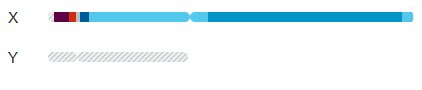
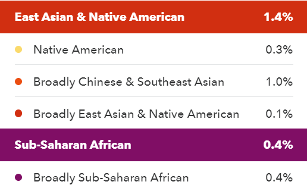

Personal Thoughts
-----------------

One thing that I think may need to be made clear to the general public is that a surprising 23andMe ancestry result may <b><u>not</b></u> necessarily be more accurate than your prior expectations.  You should consider ancestry predictions as one possible piece of evidence that you combine with other information to guide you through possible interpretations of your ancestry.

I have my "raw" 23andMe data available on the [Personal Genome Project website](https://my.pgp-hms.org/profile/hu832966), and I have also exported and uploaded a PDF Health+Ancestry report (as well as two tables of 23andMe Ancestry segments, of varying confidence).

More specifically, these are some hypothesis where I don't think the 23andMe assignments were 100% precise:

**1)** *I think my Scandinavian assignment (11%) should really be non-specific European.*

I believe 23andMe already provides some evidence to match this expectation:

*a)* **That prediction of Scandinavian ancestry goes away if I shift from 50% confidence (the default) to 90% confidence.**<br />
*b)* The "Recall" for this population is also lower than some other people in the [ancestry documentation](https://www.23andme.com/ancestry-composition-guide/) on the 23andMe website.  So, I think this is less accurate for most people.

**So, I think increasing the confidence threshold increased the accuracy of the results, and this supports my hypothesis that I don't actually have Scandinavian ancestry.**

**Update (3/21/2019)**: I thought it might be helpful to upload some screenshots of my chromosome painting at various confidence values.  You can see that they are already different than before, but the variation from **11%** and **3.6%** between different versions of ancestry prediction are a good match for my expectation that this assignment is not precise.  While I don't have the earlier screenshot for my full chromosomes, you can see that information in Excel format among these [previously uploaded files](https://drive.google.com/open?id=1uqrFxW0MrqnevFcRbRHBM1WwJwzNtLdy).

**2)** I am predicted to have 2.5% African (Sub-Saharan African, according to 23andMe).  *While this might be correct, I wonder if there might be some Northern African / Southern European that might be mixed in there.*  For example, I expect to see some Spanish and Italian ancestry that isn't showing up.

While this was a main goal of trying to check the more specific 1000 Genomes frequencies, I don't think those results are absolutely conclusive (I don't really see extremely clear evidence for SNPs within the 23andMe 90% confidence African ancestry segments are only high frequency in the current African AFR population; however, all SNPs within the segments are not informative, for example).

However, the *Genes For Good* results did indicate "West Asian and North African Ancestry was often assigned to some portions of individuals who appear to actually have European ancestry and vice-versa", and the part of African also varies with my [DNA.land](https://dna.land/) predictions (being North African instead of Sub-Saharan African, so I can see some evidence that the part of Africa may indeed not be precise).  On the other hand, the [GENOtation](http://genotation.stanford.edu/) Hapmap2 chromosome painting seems more limited (just European and African), but chr9 and chr14 are painted with African ancestry.  [GEDmatch](https://genesis.gedmatch.com/login1.php) also has some ancestry prediction under "Admixture (heritage)" results for various reference sets: to give three examples, I have some noticable African ancestry on chr15 and chr18 (with an overall estimation of 3.6% African) with the "[MDLP](http://magnusducatus.blogspot.com/) K11 Modern" model, noticeable W-African ancestry on slightly different parts of chr15 and chr18 (with an overall estimation of 2.9% W-African) with the "[HarappaWorld](https://www.harappadna.org/about/)" model, and noticeable African ancestry on chr15 and chr18 (with an overall estimation of 2.9% African) with the "[Dodecad](http://dodecad.blogspot.com/) World9" model (which I think may be the easiest for other people to visualize, within GEDmatch).

*If I export the 90% confidence predictions (from 23andMe), these are the parts that are supposed to be of African Ancestry*:

chr14:48431057-58215840<br />
chr14:94843083-95672943

chr15:26636672-33061916<br />
chr15:47723113-49749548

chr18:69836-5979832

chrX:2700157-9188835

So far, I see some indication of increasing African ancestry from other individuals on my father's side.  I think my [E-M34](https://en.wikipedia.org/wiki/Haplogroup_E-M215_(Y-DNA)) ChrY Haplogroup may be relevant, if it indicates that the increased "African" ancestry in my paternal line could in fact be from individuals who migrated from Central Africa to the North Africa and the Middle-East (and then possibly into Europe and/or the Americas).  However, I know that the chrX prediction cannot represent that same ancestry from my paternal line (although, to be fair, 90% confidence allows for some inaccurate assignments).

If it helps, here is a visualization of my chrX (with the default of 50% confidence):



and here is visualization of my chrX (with the confidence threshold increased to 90%):


Interestingly, here are the ancestry assignments for ***my Mom's X-Chromosome at 50% Confidence***:


and here are ***her*** X-chromosome assignments at ***90% Confidence***


I'm not sure if it is germline recombination or an issue with phasing, but neither of these exactly matches my X-Chromosome.  A 23andMe representative indicated recombination as the likely explanation, but I'm not 100% certain phasing issues aren't a factor.  However, if you take possible recombination into consideration, with up to the 70% confidence threshold, she does have a matching chrX segment of predicted African ancestry (matching the relatively small pseudoautosomal-adjacent segment on my X-Chromosome).  Nevertheless, the first point I want to make is that **the segment that is kept on my X-Chromosome at 90% confidence *is filtered out* from my mom's X-Chromosome at 90% confidence**, so I think that provides evidence that this could be a an incorrect ancestry assignment (whose true confidence should be lower than *my* "African" ancestry on my autosomal chromosomes, at least as my individual opinion/assessment).



Second, I also have posted the partial legend for ***my mom's 90% confidence assignments*** above because I think it is weird she would have predictions for one copy of her X-chromosome as being a different ancestries from different continents (immediately next to each other on one chromosome), **mostly because there are practically no predictions of that ancestry on *any* of her autosomal chromosomes with the 90% confidence assignments**. So, even with the higher confidence threshold, I think there is something strange about my mom's X-Chromosome ancestry (making me more confident about saying something seems off about the much smaller portion of African ancestry predicted on *my* X-chromosome, relative to the African ancestry predictions on my autosomal chromosomes).

*To be clear, I asked for my mom's permission before posting these 3 images (described in the previous paragraphs).*

**I also noticed that [Genes for Good](https://genesforgood.sph.umich.edu/), [GENOtation](http://genotation.stanford.edu/), and [GEDmatch](https://genesis.gedmatch.com/login1.php) don't provide ancestry painting for the sex chromosomes.**  Additionally, perhaps [Scheet and Stephens 2006](https://www.ncbi.nlm.nih.gov/pubmed/16532393) (Table 4 versus Table 2) and [Wise et al. 2013](https://www.ncbi.nlm.nih.gov/pubmed/23643377) (Figure 1 and "Quality and Power Concerns" section) are also relevant for this discussion?  I'm guessing they are probably less relevant, but I there are also some interesting information about repeats on chrX (and other chromosomes) in [Pandey et al. 2013](https://www.ncbi.nlm.nih.gov/pmc/articles/PMC3814197/) (and [Treangen and Salzberg 2011](https://www.ncbi.nlm.nih.gov/pmc/articles/PMC3324860/)).

***So, I am looking into this result more, since I am currently not 100% certain whether it is correct or not.***  My current hypothesis these segments represent some different type ancestry (at least for the autosomal chromosomes), but I am not sure if that should be precisely described as African ancestry (although that may in fact be correct - I just don't know for certain).

**3)** *I have a prediction of 0.1% "East Asian and Native American" that I think may be some sort of artifact.*

Unfortuantely, I don't have a more precise explanation for this hypothesis at this time.  **However, this 23andMe ancestry assignment also goes away if I change the confidence from 50% (the default) to 90%.  So, I think increasing the confidence threshold increased the accuracy of the results, and that supports my hypothesis that I don't actually have "East Asian and Native American" ancestry.**

**So, overall, the Scandinavian ancestry was for a fairly high percentage (11%), but it was for a more specific ancestry assignment (which I would expect to be harder to predict).  The possibly incorrect Sub-Saharan African and East Asia / Native American assignments were more general, but they were a small percent of my total prediction (<5%)**.  While I can believe other people may encounter higher percentager of incorrect broader ancestry assignments ([perhaps closer to 50%](https://www.nytimes.com/2018/11/19/magazine/dna-test-black-family.html), but hopefully in rare cases), I would say the broadest ancestry prediction (Mostly or Entirely European) was accurate for me.


Input (*for annotating SNP population frequencies*)
-----------

I am parsing 1000 Genomes genotypes (**ALL.chip.omni_broad_sanger_combined.20140818.snps.genotypes.vcf** from *ftp://ftp-trace.ncbi.nih.gov/1000genomes/ftp/release/20130502/supporting/hd_genotype_chip/*).

I am curious about frequencies within more specific populations, which I am calculating if there are **unrelated** or **1 child** individuals from the pedigree file.

I am using the 1000 Genomes [Super-Populations](http://www.internationalgenome.org/category/population/), as well as the populations from the pedigree file.  I prepared a very similar file for another project from the [Ogembo lab](https://www.cityofhope.org/people/ogembo-javier), so I also want to acknowledge that.

If I filter for populations represented with at least 20 such individual, this leaves me with the following counts:

*Super-Population Sample Size (Unrelated + 1 child)*:<br />
AFR: 272<br />
AMR: 135<br />
EAS: 445<br />
EUR: 364<br />
SAS: 113<br />

*Specific Population Size (Unrelated + 1 child, if greater than 20)*:<br />
ACB: 55<br />
ASW: 43<br />
CDX: 100<br />
CHB: 108<br />
CHS: 51<br />
CLM: 35<br />
FIN: 100<br />
GBR: 101<br />
GIH: 113<br />
IBS: 50<br />
JPT: 105<br />
KHV: 80<br />
LWK: 116<br />
MXL: 30<br />
PEL: 35<br />
PUR: 35<br />
TSI: 112<br />
YRI: 58

I am also using a 23andMe file converted to a VCF file (see the main [23andMe section](https://github.com/cwarden45/DTC_Scripts/tree/master/23andMe))

Annotation
-----------

1) Reformat large 1000 Genomes genotype table into a frequency table using `calculate_vcf_frequencies.pl`.

I have saved a compressed version such a file [here](https://drive.google.com/open?id=1uqrFxW0MrqnevFcRbRHBM1WwJwzNtLdy) (for the unrelated and 1 child individuals).

```diff
- However, I want to make clear this is something that I created relatively quickly for my own purposes, so this is not equilvlant to something coming from the 1000 Genomes project (which has been subject to many more questions and testing).
```

Accordingly, I am expecting other people to need to modify the code itself (towards the top of the file) to test application to their own sample.  I apologize for the inconvience, but I could admittedly make most of my main points above without any coding (*namely, 2 out of the 3 results that I thought seemed suspicious could be removed by choosing a higher confidence level within 23andMe*).

2) Look for variants also present in your own .vcf file using `annotate_present_variants.pl`.

I am parsing the 23andMe raw data file that I converted (with limitations such as only looking at SNPs, not indels, etc.).  This type of .vcf file has some repeat annotations (as well as sites that match the reference at both alleles), but I am only considering adding the 1000 Genomes annotations to those with a "PASS" status (without being annotated as coming from a repeat) and variants actually present in my .vcf file.

3) As of 2/3/2019, I noticed that 23andMe provides a way to download the intervals of the ancestry predictions as a CSV file.  So, if you have a specific region that you are trying to understand better (which is what I mention in the "Personal Thoughts" above), you can use the genome positions to filter specific SNPs to view (such as checking the population frequencies for variants within segments that 23andMe predicts to be of African Ancestry with 90% confidence).  You can click [this link](https://drive.google.com/open?id=1uqrFxW0MrqnevFcRbRHBM1WwJwzNtLdy) to see such files for my own sample.
