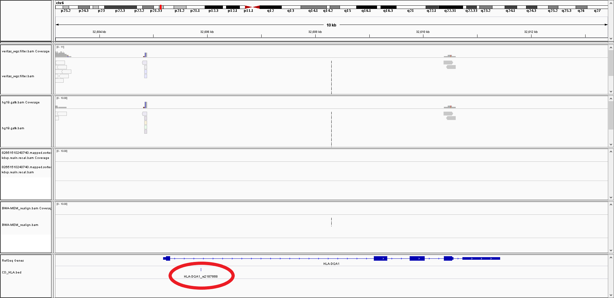
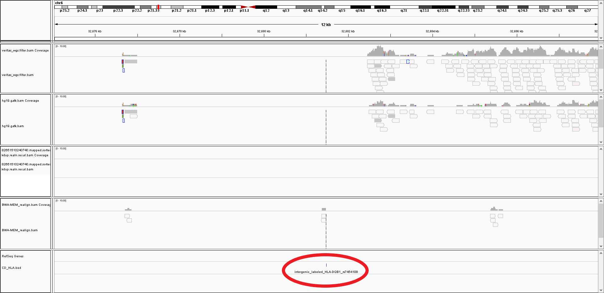
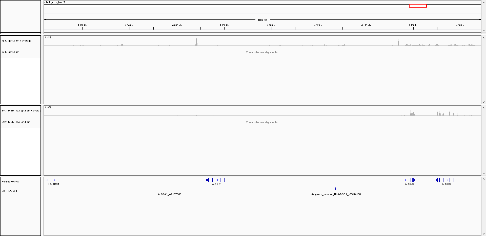
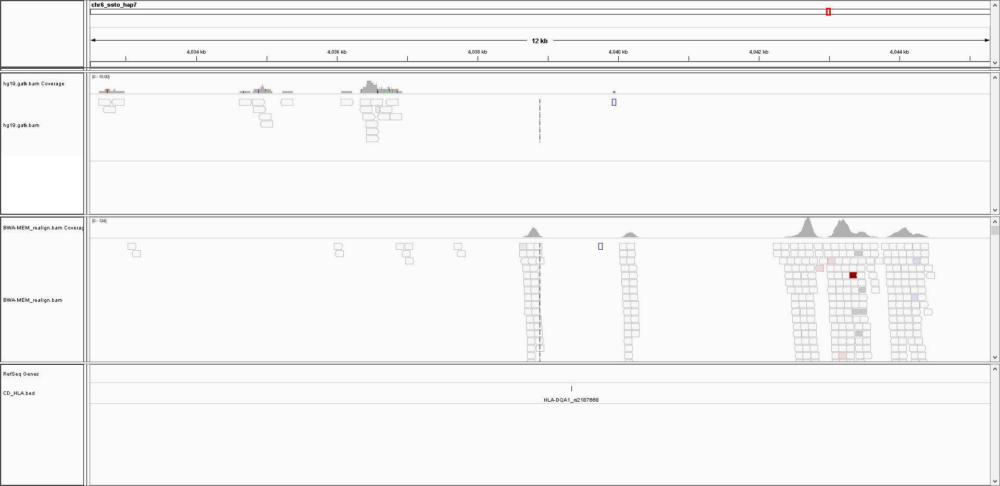

Personal Thoughts
-----------------

***My regional ancestry is mostly European***: 42% England / Wales / Northwestern Europe, 22% Germanic Europe, 21% Ireland & Scotland, 8% Norway, 3% Sweden, 2% Benin/Togo, 2% Ivory Coast / Ghana, and 1% European Jewish.

**Update(10/23/2019)**: I think clicking for more information about the region is interesting.  For example, the lower limit for "Germanic Europe" and "Ireland & Scotland" was ***0%*** (as well as everything except "England / Wales / Northwestern Europe" which had a range of 42-61%).

**Update(9/15/2020)**: I think the increase in Scottish ancestry might not be correct.  However, even though it now has the largest individual assignment, the lower limit for "Scotland" was ***0%***.  So, I would say that is consistent with my general thought that there should be greater focus on [broad ancestry](http://cdwscience.blogspot.com/2019/08/genome-wide-broad-level-super.html) and more false positives for some of the specific country-level assignments.

My maternal (relatively) recent ancestry is from Arkanasas (near Memphis) and Tennessee, so the "Additional Community" result of "Northern Arkansas & Middle Tennessee Settlers" was interesting.  However, I think this would be more useful as a sort of free analysis for exported raw data (rather than purchasing another chip).

I also found some additional family members that had AncestryDNA data, but not 23andMe data.  However, I think recommending people deposit their data into public databases to search for family members is preferable than having everybody purchase both 23andMe and AncestryDNA tests to search both sets of customers for family members.  

I also ordered the version of AncestryDNA that provides some trait information, and I filled out the questions for the "Personal Discoveries Project."  The Traits results are a little hard to view all at once, but I think providing the regional ancestry variation for each trait was interesting.

I uploaded my AncestryDNA data and reports to [my PGP page](https://my.pgp-hms.org/profile/hu832966), if anybody wants to look into those.  There were some noticeable differences for the [DNA.land](https://dna.land/) ancestry estimations for my 23andMe chip versus my AncestryDNA chip, but both of those are up there (if you want to compare similar reports for the same individual, but using different chips).

***So, overall, I wouldn't push too hard for people to have an additional test (and I'm not purchasing the additional Ancestry membership), but I think it provides some potentially interesting information.  For an extra $10, I think the extra traits results are worth it.***

Raw Data File Conversion
-----------

I actually had an earlier [blog post](http://cdwscience.blogspot.com/2013/12/additional-analysis-of-ancestrydna-data.html) where I did some file conversion and analysis for somebody else.  So, that was one less thing that I had to write for my own data!

Similar to my [Genes for Good](https://github.com/cwarden45/DTC_Scripts/tree/master/Genes_for_Good) data, I tested making HLA Predictions below.

HLA Analysis Results
-----------

### For Research Purposes Only! ###

I had the V3 23andMe chip for my sample.  My AncestryDNA chip had 667,884 probes.

Below, my HLA-A, HLA-B, and HLA-C results are robust with the different genotyping and sequencing technologies, but my HLA-D type assignments change.

<table>
  <tbody>
    <tr>
      <th align="center">Marker</th>
      <th align="center">SNP2HLA</th>
      <th align="center">HIBAG</th>
      <th align="center">bwakit</th>
      <th align="center">HLAminer</th>
    </tr>
    <tr>
      <td align="center">HLA-A</td>
      <td align="left">A*01, A*02 (23andMe)  A*01, A*02 (Genes for Good)  A*01, A*02 (<b>AncestryDNA</b>)</td>
      <td align="left">A*01, A*02 (23andMe)  A*01, A*02 (<b>AncestryDNA</b>)</td>
      <td align="left">A*01, A*02 (Genos Exome BWA-MEM)</td>
      <td align="left">A*01, A*02 (Genos Exome BWA-MEM)  A*01, A*68 (Genos Exome BWA)</td>
     </tr>
    <tr>
      <td align="center">HLA-B</td>
      <td align="left">B*08, B*40 (23andMe)  B*08, B*40 (Genes for Good)  B*08, B*40 (<b>AncestryDNA</b>)</td>
      <td align="left">B*08, B*40 (23andMe)  B*08, B*40 (<b>AncestryDNA</b>)</td>
      <td align="left">B*08, B*40 (Genos Exome BWA-MEM)</td>
      <td align="left">B*08, B*40 (Genos Exome BWA-MEM)  B*08, B*41 (Genos Exome BWA)</td>
     </tr>
    <tr>
      <td align="center">HLA-C</td>
      <td align="left">C*03, C*07 (23andMe)  C*03, C*07 (Genes for Good)  C*03, C*07 (<b>AncestryDNA</b>)</td>
      <td align="left">C*03, C*07 (23andMe)  C*03, C*07 (<b>AncestryDNA</b>)</td>
      <td align="left">C*03, C*07 (Genos Exome BWA-MEM)</td>
      <td align="left">C*03, C*07 (Genos Exome BWA-MEM)  C*03, C*07 (Genos Exome BWA)</td>
     </tr>
    <tr>
      <td align="center">HLA-DRB1</td>
      <td align="left">DRB1*01, DRB1*03 (23andMe)  DRB1*01, DRB1*03 (Genes for Good)  DRB1*01, DRB1*03 (<b>AncestryDNA</b>)</td>
      <td align="left">DRB1*03, DRB1*11 (23andMe)  DRB1*03, DRB1*15 (<b>AncestryDNA</b>)</td>
      <td align="left">DRB1*04, DRB1*04 (Genos Exome BWA-MEM)</td>
      <td align="left">DRB1*01, DRB1*15 (Genos Exome BWA-MEM)  DRB1*01, DRB1*15 (Genos Exome BWA)</td>
     </tr>
     <tr>
      <td align="center">HLA-DQA1</td>
      <td align="left">DQA1*05, DQA1*05 (23andMe)  DQA1*01, DQA1*05 (Genes for Good)  DQA1*01, DQA1*05 (<b>AncestryDNA</b>)</td>
      <td align="left">DQA1*05, DQA1*05 (23andMe)  DQA1*01, DQA1*05 (<b>AncestryDNA</b>)</td>
      <td align="left">DQA1*03, DQA1*03 (Genos Exome BWA-MEM)</td>
      <td align="left">DQA1*02, DQA1*03 (Genos Exome BWA-MEM)  DQA1*02, DQA1*03 (Genos Exome BWA)</td>
     </tr>
     <tr>
      <td align="center">HLA-DQB1</td>
      <td align="left">DQB1*02, DQB1*05 (23andMe)  DQB1*02, DQB1*02 (Genes for Good)  DQB1*02, DQB1*05 (<b>AncestryDNA</b>)</td>
      <td align="left">DQB1*02, DQB1*03 (23andMe)  DQB1*03, DQB1*06 (<b>AncestryDNA</b>)</td>
      <td align="left">DQB1*03, DQB1*03 (Genos Exome BWA-MEM)</td>
      <td align="left">DQB1*02, DQB1*03 (Genos Exome BWA-MEM)  DQB1*02, DQB1*03 (Genos Exome BWA)</td>
     </tr>
</tbody>
</table>

23andMe reports that I lack the [rs2187668](https://www.ncbi.nlm.nih.gov/snp/rs2187668) variant for *HLA-DQ2.5*, but I carry *both* copies of the C [rs7454108](https://www.ncbi.nlm.nih.gov/snp/rs7454108) variant for **HLA-DQ8**.  Unlike the methods described above, this uses a methodology similar to [Monsuur et al. 2008](https://journals.plos.org/plosone/article?id=10.1371/journal.pone.0002270) (as well as other citations provided within 23andMe).  However, 23andMe also provided [this helpful GeneReviews reference](https://www.ncbi.nlm.nih.gov/books/NBK1727/), which defines *DQ2-positive* as "HLA-DQA1\*0501/0505 and
HLA-DQB1\*0201/0202" and **DQ8-positive** as "HLA-DQA1\*03 and
HLA-DQB1\*0302", and indicates DQ2/DQ2.5 (the one 23andMe says I don't have) is the more prevalent (>90%) among those with Celiac Disease (although many people are also DQ2 that don't have the disease).

FYI, you can download HLA reference sequences from this ftp: ftp://ftp.ebi.ac.uk/pub/databases/ipd/imgt/hla/fasta/  
* With [BLAT](https://genome.ucsc.edu/cgi-bin/hgBlat?command=start), those 2 variant sites used by 23andMe are still intronic / intergenic for DQA1\*05:01 and DQB1\*02:01/\*02:02 (although it looks like it can be an exonic overlap for *DQA1\*05:05*, for *rs2187668*, which is the variant with the most significant, validated association in [Dubois et al. 2010](https://www.ncbi.nlm.nih.gov/pmc/articles/PMC2847618/)). 
* You can also do things like a [BLAST](https://blast.ncbi.nlm.nih.gov/Blast.cgi) search with the primers in [Table S1](https://journals.plos.org/plosone/article?id=10.1371/journal.pone.0002270#s5) of the Monsuur et al. 2008 publication.  There is also a BLAST interface from [IPD-IMGT/HLA](https://www.ebi.ac.uk/ipd/imgt/hla/blast.html).

In terms of the updates that I added on 2/28 (mostly in the 1-2 paragraphs above), I would like to thank [Susan Neuhausen](https://www.cityofhope.org/people/neuhausen-susan) for discussions that encouraged me to take more time review the literature for these results more carefully.

**I also thought it might be helpful to show some screenshots with my Veritas WGS and Genos Exome datasets**

There was something similar at the bottom of the page for my Cystic Fibrosis variant at the bottom of the [Genos Exome](https://github.com/cwarden45/DTC_Scripts/tree/master/Genos_Exome) section.  However, to briefly review what I am showing, if there is a total of 4 alignment tracks, the 1st two tracks are Whole Genome Sequencing data (processed two different ways), and the next two tracks are Exome data (processed in two different ways).  In this case, I also added a track for the 23andMe Celiac Disease variants at the bottom (which I thought was helpful when there weren't actually any reads aligned to that exact nucleotide - the WGS and Exome assignments from the table above align to a different reference set, not using the typical genome alignment):

In contrast, the screenshots below only have 2 alignment tracks (with non-canonical HLA contigs, only in the re-processed alignments, not in the provided alignments; the top alignment is Veritas WGS and the bottom alignment is Genos Exome):

I checked and there weren't any reads aligned at those exact position on any of the alternative chromosomes.  However, here is a screenshot where I thought the alignments were relatively nearby (and there had to be some alignment in those genes, using that other reference, in order to get the predictions in the table above):

In the screenshot above, you would expect everything from my Exome data to be covered in my WGS data.  However, Veritas provided the alignments in per-chromosome .bam files (without providing .fastq files).  So, I am guessing the reads you see on my Exome dataset (bottom) could have also been obtained if I had access to the unaligned reads (that weren't aligned to the canonical chromosomes in hg19) in my Whole Genome Sequencing data (top).
