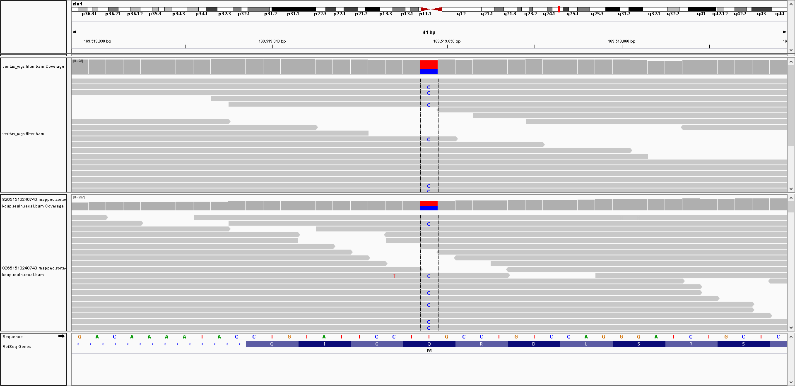

I purchased a kit from Color because I really liked their [public portal](https://data.color.com/) to browse variant information.

While the return of data was not automated, I was allowed to fill out a HIPPA authorization form for Protected Health Information (PHI), which included a box to check for "Raw Genetic Data."  Once I get that, I will upload it to my [Personal Genome Project page](https://my.pgp-hms.org/profile/hu832966).

**Update (7/28)**: I am still encountering some issues uploading my data to the PGP (even though the Color raw data is very small).  Nevertheless, if you wanted to access the 2 genotype tables and low-coverage FASTQ file, those can be downloaded from my Google Cloud account:

https://storage.googleapis.com/bastu-cat-genome/temp_human_forCharles/Color/38721806153623_discovery_genotypes.csv

https://storage.googleapis.com/bastu-cat-genome/temp_human_forCharles/Color/38721806153623_variant_set.csv

https://storage.googleapis.com/bastu-cat-genome/temp_human_forCharles/Color/38721806153623_lcWGS.fastq.gz

**Update (7/29)**: While the higher-coverage FASTQ and/or BAM files weren't among the raw data provided, it was confirmed that such sequencing was performed: "*We do low coverage sequencing on top of the next generation sequencing that we use for the analysis of the genes on our panel.  Every gene on our panels is sequenced using next generation sequencing with a minimum coverage of 20X (compared to the coverage obtained with the low coverage sequencing). The median read depth for the genes analyzed is 250X.  Secondary confirmation is part of our process as well and in some cases can add additional time to our turnaround time of 3-4 weeks.*"

I didn't immediately recognize that I had the F5 Leiden mutation (increased risk of blood clots, [rs6025](https://www.ncbi.nlm.nih.gov/snp/rs6025), chr1:169519049 on hg19), but I could verify the status of that variant with my sequencing alignment from Veritas and Genos:

I should also be able to verify that with my HIPPA-released data (and then I will post an update).

More importantly, I actually did have a [23andMe report](https://you.23andme.com/reports/ghr.vte/) indicating increased risk for "*Hereditary Thrombophila*", but I had to recognize the different name (even though it was a report for the exact same variant, and "*Factor V Leiden variant*" was mentioned in the 23andMe report).  Also, the "variant present" designation in Color made me think the predictive power may be higher than a typical risk association (more like a carrier status).  However, I think the ***23andMe Report*** better matches my previous expectation:

***General population***: 1 in 1,000 (1-year risk)

***One copy of Factor V Leiden variant***:	2 in 1,000 (1-year risk)

***Two copies of Factor V Leiden variant***:	15 in 1,000 (1-year risk)

**Taking some time to search through the primary literature helped me understand the results better** (although I should still continue to learn more).  For example, *Figure 1* in [Rosendaal et al. 1995](https://www.ncbi.nlm.nih.gov/pubmed/7888671) shows the much greater effect of the homozygous variant, specifically in the age group 50-69 (even though there were only **7** total AA individuals).  However, [Genetics Home Reference](https://ghr.nlm.nih.gov/condition/factor-v-leiden-thrombophilia) cites an even higher risk of incidence (up to 80 in 1000) for *Factor V Leiden thrombophilia*.  A review by [Kujovich 2011](https://www.ncbi.nlm.nih.gov/pubmed/21116184) also says "*Factor V Leiden is the most common genetic risk factor for [Venous thromboembolism], found in 20–25% of patients with VTE and 50% of patients with familial thrombophilia*".  So, if I had a homozygous variant, this may be something worth considering later in life (even though my wisdom tooth removal went smoothly when I was a teenager).

I also thought it was interesting in that the risk allele changed from being the genome reference in hg19 to the alternate allele in hg38 (which you can see in the [dbSNP entry](https://www.ncbi.nlm.nih.gov/snp/rs6025#variant_details)).  This explains why the high risk is the "AA" allele in the example described above.  Also, please note that the incidence in that figure is per 10,000 individuals (although even that seems like a lot with 7 individuals, which already happened to be 6 female and 1 male, with only 1 female being >50 years old).

23andMe had some extra citations beyond ClinVar, which included a paper by [Grody et al. 2001](https://www.ncbi.nlm.nih.gov/pmc/articles/PMC3111091/) which said "Random screening of the general population for factor V Leiden is not recommended," but it also described "functional activated protein C (APC) resistance testing" as a possible alternative to the DNA test (and comparing those options was the topic for that article).

Some reports are also up on my PGP page, but I also encounted some issues uploading PDF files recently.  So, I decided to go ahead and post all of that information here.

I also though the following notes from the ordering physican were interesting:

- **A possible drug-drug interaction was detected:** Some of the medications you shared you are taking (indomethacin and citalopram) may have an increased risk of an interaction. Please do not make any changes to your medications before speaking to your provider. The benefits of taking these interacting medications at the same time can often outweigh the risks and stopping a medication suddenly could be harmful. We recommend you speak with the healthcare provider who prescribed these medications to discuss if they are working as intended.
- **Your other medications may affect how your body processes medications:** Some of the medications you shared you are taking (citalopram) may impact how your body processes medications. Taking these medications at the same time may lead to a different response to the medications than the genetic results suggest. Please do not make any changes to your medications before speaking to your provider. The benefits of taking these interacting medications at the same time can often outweigh the risks, and stopping a medication suddenly could be harmful. We recommend you speak with the healthcare provider who prescribed these medications to discuss if they are working as intended.

There was also the following general note (as of 6/27/2019) under "**Medications and your genetic results**": You may notice that there is no information about specific medications in your report. The FDA recently issued a safety communication about genetic tests that claim to predict patients’ responses to specific medications. In response to the FDA’s communication and out of an overabundance of caution, our reports and clinical pharmacists are not currently providing information about specific medications. We continue to explore ways to add information about medication in accordance with FDA guidance and will update you when any new information is added.

I'm not sure if these were manually entered.  However, I talked to the Clinical Pharmacist (free), and I learned that the drug interaction was reported from 3rd party software (from PWN Health).  So, I will follow-up on that to see if I can find the primary evidence for those notes (even though that doesn't involve any genetic information).

The "*Medication Response*" results also allow you to schedule an appointment with a clinical pharmacist at no additional cost.  So, I will also check that out and post some notes here.

The "*Medication Response*" portion also covers 14 genes, but 2 genes (CYP2C19 and CYP2D6) were provided at the same time as the other results whereas there was a total wait time of ~6 months for the other 12 genes (CYP1A2, CYP2C9, CYP3A4, CYP3A5, CYP4F2, DPYD, NUDT15 rs116855232, TPMT, F5 rs6025, IFNL3 rs12979860, SLCO1B1 rs4149056, and VKORC1 rs9923231).

I think the "*Medications and your genetic results*" note is the reason that I have Mental Health Medication Insights in the 2-gene report but not the 14-gene report.  However, if the "FDA exercises enforcement discretion" *FDA Category Designation* status in the [Genetic Testing Registry](https://www.ncbi.nlm.nih.gov/gtr/tests/561719/performance-characteristics/) relates to the specific drug associations, then I am surprised that there hasn't been a more severe consequence for Myriad's GeneSight test that has [the same designation in the GTR](https://www.ncbi.nlm.nih.gov/gtr/tests/508961/performance-characteristics/).  For example, there was a [GenomeWeb article](https://www.genomeweb.com/regulatory-news/fda-tells-patients-docs-take-caution-when-using-unapproved-pgx-tests-make-treatment) in late 2018 mentioning the GeneSight did not have FDA approval.

I also thought I saw a warning that medication predictions can be less accurate if you take multiple medications, but I am having a hard time finding such a communciation from Color (so, perhaps I am remembering something incorrectly, or I possibly misread one of the bold notes above).
