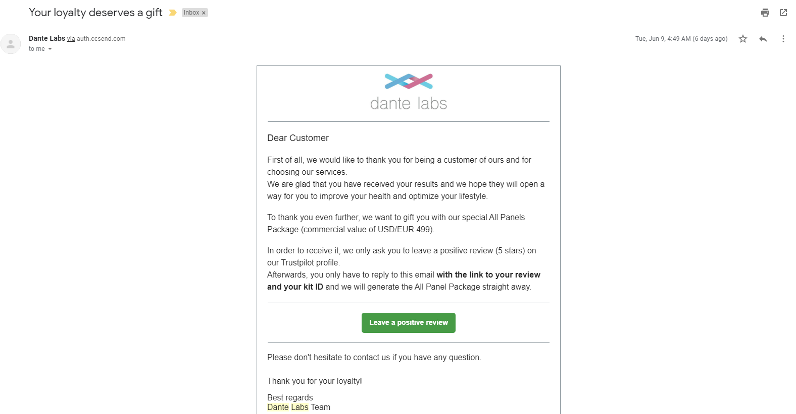

I think most people get reports with sequencing performed by Dante Labs.  However, I tested uploading different files using [this link](https://us.dantelabs.com/products/import-your-genetic-data).

More specifically, I tested uploading the following files for at least 1 of the 3 available reports:

 - **23andMe** ("*Nutrigenomics & Lifestyle*", "*Fitness*", and "*Wellness & Lifestyle*")
 - **AncestryDNA** ("*Nutrigenomics & Lifestyle*", "*Fitness*", and "*Wellness & Lifestyle*")
 - **BWA-MEM + GATK Re-Aligned Veritas WGS .vcf** ("*Nutrigenomics & Lifestyle*")

Even with the discount of $4.99 instead of $49.99, I decided not to further test other .vcf files (even though I could have done so for other data types, such as my Genos Exome VCF, my Helix Exome+ gVCF from Mayo GeneGuide, my Nebula imputed gVCF, etc.).
 
Uploading a .vcf cost $19.99 instead of $4.99, so that is why I only generated one type of report for that.

You can see the drafts and idenfifiers (if available) for the FDA MedWatch reports that I submitted [here](https://drive.google.com/file/d/1xigiaFiCRX_aKqyuypMnw-9B4Z8IxQrX/view?usp=sharing).  You can also see additional details below.

I am currently waiting for those additional MedWatch identifiers to submit a negative review on TrustPilot, but I already have ethnical concerns with offering a product worth $499 only if a **positive 5 star review** is provided:

For example, I think that could be interpreted as a bribe by some.

To be fair, that interpretation may not have been taken under consideration by the company.  While I still think it may still skew reviews, an alternative would be the strategy used by *Nebula Genomics*: anyone posting a review (**regardless of score**) recieved a $10 Amazon gift card.  For example, you can see my review [here](https://drive.google.com/file/d/1tpBPZC8qt7Wb9MqLdixqCEx5cms0Xjb-/view) (with a longer explanation in [this blog post](http://cdwscience.blogspot.com/2019/08/low-coverage-sequencing-is-not.html)).

I also reference this content in this [nutrigenomics blog post](http://cdwscience.blogspot.com/2019/08/emphasis-on-hypothesis-generation-for.html), although this was not the primary focus of that blog post (and that is only directly related to 1 out of my 3 Dante Labs reports).

**In terms of the sciencific problems**:

 In order to avoid paying twice (to test the effect of .vcf formating), I uploaded the GATK .vcf from a re-alignment with BWA-MEM froma the Veritas FASTQ files.  The freebayes indel formatting is a little different, and I wanted to avoid a difference that could be due to a formatting issue.
 
 Also, I got an error message if I tried to upload an compressed .vcf file (or my .gVCF file).  ***So, that makes me concerned that the upload may not actually be compatible for large gVCF files.***
 
 I purchased this after my other [Nutrigenomics Tests](https://github.com/cwarden45/DTC_Scripts/tree/master/Nutrigenomics).  However, the other 2 reports are fairly different.  For most people, I think they would probably be most intersted in the ***Wellness & Lifestyle*** (which includes disease risk), although the results matched what I had seen from other companies (in terms of where I was supposed to be at higher risk) and this is most similar to what 23andMe had to temporarily remove while the results were checked by the FDA.
 
 Out of the 3 reports, only the "*Wellness & Lifestyle*" reported anything dante labs considered to be at high risk:
 
  - **Factor V Leiden thrombophilia** ([rs6025](https://www.ncbi.nlm.nih.gov/snp/rs6025); [F5](https://www.ncbi.nlm.nih.gov/gene/2153); *chr1:169519049*) - also in my [23andMe and Color reports](https://github.com/cwarden45/DTC_Scripts/tree/master/Color).  As someone with 1 copy of the variant, I would consider it lower risk than some other pathogenic variants, but it is in [ClinVar](https://www.ncbi.nlm.nih.gov/clinvar/RCV000000674.4/)
  - **Age-related macular degeneration** ([rs10490924](https://www.ncbi.nlm.nih.gov/snp/rs10490924); [ARMS2](https://www.ncbi.nlm.nih.gov/gene/387715); *chr10:124214448*) - this is the same variant as my [23andMe report](https://you.23andme.com/reports/ghr.amd/) which says "*Variant detected, **not** likely at increased risk*".  There are some ClinVar entries, but the links from dbSNP say [both "Risk-Factor" and "Likely-Benign"](https://www.ncbi.nlm.nih.gov/snp/rs10490924#clinical_significance)
  
 **So, I am not actually suggesting others purchase any of these reports, if they already have a 23andMe or similar report.**  In general, my opinion is that this is either the type of re-analysis that would be provided for free, or where the evidence and or level of risk may or may not be high.
 
By eye, these are the differerences that I can find between the 23andMe and AncestryDNA uploaded files:

**1) Nutrigenomics & Lifestyle:** *Predisposition to the deficiency of pantothenic acid (page 3)*: 23andMe upload says "People with your genetic profile are likely to have a predisposition for **pantothenic acid deficiency**" while AncestryDNA upload says "People with your genetic profile are likely to have **regular pantothenic acid levels**".  I believe this is due to a difference in the genotype for the [rs13141016](https://www.ncbi.nlm.nih.gov/snp/rs13141016) variant in the IGFBP7 gene (GG for 23andMe on page 38; AA for AncestryDNA on page 36)

I checked my Veritas WGS alignments, and this matches the genotype in my 23andMe report ([GG](IGV_NL.rs13141016.png)).

I checked my raw AncestryDNA data, and I couldn't find a genotype for rs13141016.  I contacted the company and they said that they don't impute genotypes, although I am not sure what is the alternative explanation.

**2) Nutrigenomics & Lifestyle:** *Predisposition to develop sensitivity to metabisulphites (page 6)*: 23andMe upload says "People with your genetic profile **are not likely** to have a predisposition to develop a metabisulphites sensitivity" while AncestryDNA upload says "People with your genetic profile **are likely** to have a predisposition to develop a metabisulphites sensitivity".  I believe this is due to a difference in the genotype for the [rs523865](https://www.ncbi.nlm.nih.gov/snp/rs523865) variant in the ANGPT4 gene (AA for 23andMe on page 112; AG for Ancestry DNA on page 110)

I checked my Veritas WGS alignments, and this matches the genotype in my AncestryDNA report ([AG](IGV_NL.rs523865.png)).

I checked my raw 23andMe data, and I couldn't find a genotype for rs523865.  I contacted the company and they said that they don't impute genotypes, although I am not sure what is the alternative explanation.

**3) Fitness:** *Impulsivity (page 3)*: 23andMe upload says "People with your genetic profile are likely to have a **lower** tendency to act impulsively" while AncestryDNA upload says "People with your genetic profile are likely to have a **higher** tendency to act impulsively".  I believe this is due to a difference in the genotype for the [rs1406946](https://www.ncbi.nlm.nih.gov/snp/rs1406946) variant in the HTR1E gene (CC for 23andMe on page 34; TT for AncestryDNA on page 34)

I checked my Veritas WGS alignments, and this matches the genotype in my AncestryDNA report ([TT](IGV_F.rs1406946.png)).

I checked my raw 23andMe data, and I couldn't find a genotype for rs1406946.  I contacted the company and they said that they don't impute genotypes, although I am not sure what is the alternative explanation.

**4) Fitness:** *Energy expenditure (page 4)*: 23andMe upload says "People with your genetic profile are likely to have a **higher** energy consumption" while AncestryDNA upload says "People with your genetic profile are likely to have a **normal** consumption of energy".  I believe this is due to a difference in the genotype for the [rs7799039](https://www.ncbi.nlm.nih.gov/snp/rs7799039) variant in the LEP gene (GA for 23andMe on page 54; GG for AncestryDNA on page 54)

I checked my Veritas WGS alignments, and this matches the genotype in my 23andMe report ([GA](IGV_F.rs7799039.png)).

I checked my raw AncestryDNA data, and I couldn't find a genotype for rs7799039.  I contacted the company and they said that they don't impute genotypes, although I am not sure what is the alternative explanation.

**5) Fitness:** *Energy supply (page 4)*: 23andMe upload says "People with your genetic profile are likely to have a **regular** energy intake" while AncestryDNA upload says "People with your genetic profile are likely to have **greater** energy intake".  I believe this is due to a difference in the genotype for the [rs5418](https://www.ncbi.nlm.nih.gov/snp/rs5418) variant in the SLC2A4 gene (GG for 23andMe on page 55; GA for AncestryDNA on page 55)

I checked my Veritas WGS and Genos Exome alignments, and this matches the genotype in my AncestryDNA report ([GA](IGV_F.rs5418.png)).

I checked my raw 23andMe data, and I couldn't find a genotype for rs5418.  I contacted the company and they said that they don't impute genotypes, although I am not sure what is the alternative explanation.

**6) Fitness:** *Metabolism of essential amino acids (page 4)*: 23andMe upload says "People with your genetic profile are likely to have a **high** metabolism of essential amino acids" while AncestryDNA upload says "People with your genetic profile are likely to have a **normal** metabolism of essential amino acids".  I believe this is due to a difference in the genotype for the [rs2295080](https://www.ncbi.nlm.nih.gov/snp/rs2295080) variant in the MTOR gene (TT for 23andMe on page 56; GG for AncestryDNA on page 56)

I checked my Veritas WGS and Genos Exome alignments, and this matches the genotype in my 23andMe report ([TT](IGV_F.rs2295080.png)).

I checked my raw AncestryDNA data, and I couldn't find a genotype for rs2295080.  I contacted the company and they said that they don't impute genotypes, although I am not sure what is the alternative explanation.

**7) Fitness:** *Deficiency Of Colina (page 4)*: 23andMe upload says "People with your genetic profile **tend to have** a choline deficiency" while AncestryDNA upload says "People with your genetic profile are **likely not to have** a tendency for choline deficiency".  I believe this is due to a difference in the genotype for the [rs4646365](https://www.ncbi.nlm.nih.gov/snp/rs4646365) variant in the PEMT gene (CT for 23andMe on page 70; CC for AncestryDNA on page 70)

I checked my Veritas WGS alignments, and this matches the genotype in my 23andMe report ([CT](IGV_F.rs4646365.png)).

I checked my raw AncestryDNA data, and I couldn't find a genotype for rs4646365.  I contacted the company and they said that they don't impute genotypes, although I am not sure what is the alternative explanation.

**8) Fitness:** *Subcutaneous adipose tissue (page 4)*: 23andMe upload says "People with your genetic profile are likely to have **regular** accumulation of subcutaneous adipose tissue" while AncestryDNA upload says "People with your genetic profile are likely to have a **reduced** accumulation of subcutaneous adipose tissue".  I believe this is due to a difference in the genotype for the [rs2304795](https://www.ncbi.nlm.nih.gov/snp/rs2304795) variant in the PLIN1 gene (AA for 23andMe on page 79; AG for AncestryDNA on page 79)

I checked my Veritas WGS and Genos Exome alignments, and this matches the genotype in my AncestryDNA report ([AG](IGV_F.rs2304795.png)).

I checked my raw 23andMe data, and I couldn't find a genotype for rs2304795.  I contacted the company and they said that they don't impute genotypes, although I am not sure what is the alternative explanation.

**9) Fitness:** *Balance of sodium / potassium ratio (Na/K) (page 5)*: 23andMe upload says "People with your genetic profile are likely to have a **regular** sodium/potassium ratio" while AncestryDNA upload says "People with your genetic profile are likely to have a **high** sodium/potassium ratio".  I believe this is due to a difference in the genotype for the [rs956868](https://www.ncbi.nlm.nih.gov/snp/rs956868) variant in the WNK1 gene (AA for 23andMe on page 85; AC for AncestryDNA on page 85)

I checked my Veritas WGS and Genos Exome alignments, and this matches the genotype in my AncestryDNA report ([AC](IGV_F.rs956868.png)).

I checked my raw 23andMe data, and I couldn't find a genotype for "No Call" (--). I contacted the company and they said that they don't **impute** genotypes, although I am not sure what is the alternative explanation.  If the issues did come from imputed genotypes, then would be consistent with it being very good that 23andMe does not return imputed variants.

**10) Fitness:** *Zinc balance (Zn) (page 5)*: 23andMe upload says "People with your genetic profile are likely to have a **low** zinc level" while AncestryDNA upload says "People with your genetic profile are likely to have a **regular** zinc level".  I believe this is due to a difference in the genotype for the [rs12906126](https://www.ncbi.nlm.nih.gov/snp/rs12906126) variant in the SCAMP5 gene (GT for 23andMe on page 88; GG for AncestryDNA on page 88)

I checked my Veritas WGS alignments, and this matches the genotype in my 23andMe report ([GT](IGV_F.rs12906126.png)).

I checked my raw AncestryDNA data, and I couldn't find a genotype for rs12906126.  I contacted the company and they said that they don't impute genotypes, although I am not sure what is the alternative explanation.

**11) Fitness:** *Rotator cuff disease (page 5)*: 23andMe upload says "People with your genetic profile are likely to have a **higher** susceptibility to rotator cuff disease" while AncestryDNA upload says "People with your genetic profile are likely to have **regular** susceptibility to rotator cuff disease".  I believe this is due to a difference in the genotype for the [rs1800972](https://www.ncbi.nlm.nih.gov/snp/rs1800972) variant in the DEFB1 gene (GG for 23andMe on page 102; CC for AncestryDNA on page 102)

I checked my Veritas WGS and Genos Exome alignments, and this matches the genotype in my 23andMe report ([GG](IGV_F.rs1800972.png)).

I checked my raw 23andMe data, the genotype was in fact "GG".  ***So, looks like a truely inaccurate genotype, but this only makes up 1 out of the 11 discordant genotypes that I found.***

There may exist issues, but this is what I could find.  When the uploaded .vcf report is complete, then I can add that for 1 report.

Also, for the 11 discordant genotypes described above, only 2 ([rs2304795](https://www.ncbi.nlm.nih.gov/snp/rs2304795) and [rs956868](https://www.ncbi.nlm.nih.gov/snp/rs956868)) were listed in ClinVar.  This would be consistent with questioning if these were actionable, robust, and highly predictive results.

While I didn't see any inconsistent genotypes by eye between the "Wellness and Lifestyle" reports for 23andMe and AncestryDNA data, I am a [cystic fibrosis carrier](http://cdwscience.blogspot.com/2019/08/digging-deeper-into-my-cystic-fibrosis.html) and **both reports from Dante Labs *incorrectly* said that I was *not* an cystic fibrosis carrier**.  So, I would say that there was at least 1 serious problem that I found with each report.

I was also a little concerned that the link to upload my "Wellness & Lifestyle" 23andMe data actually said "AncestryDNA: Fitness (Kit ID: TPD16382842155959)" as well as "Upload Your Genetic Data from 23andMe".  However, the report I recieved was in fact different than the other reports (so, I would consider this a minor typo.)
