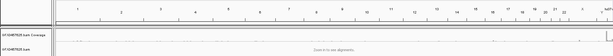
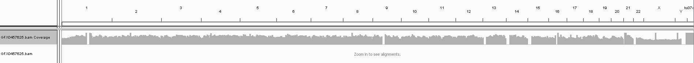
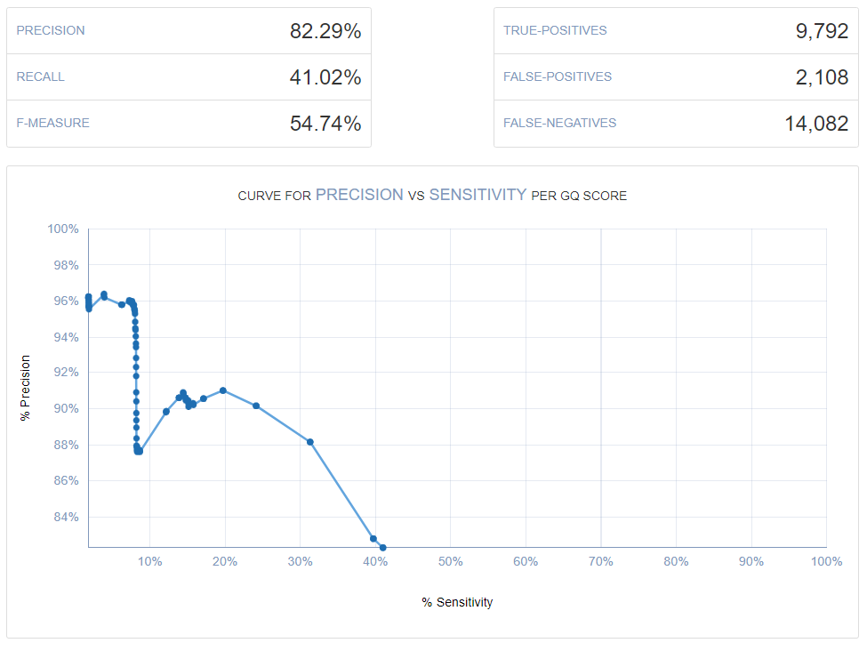

## Strategy #1: Upload Data Generated Outside of Dante Labs

I think most people get reports with sequencing performed by Dante Labs.  However, I tested uploading different files using [this link](https://us.dantelabs.com/products/import-your-genetic-data).

More specifically, I tested uploading the following files for at least 1 of the 3 available reports:

 - **23andMe** ("*Nutrigenomics & Lifestyle*", "*Fitness*", and "*Wellness & Lifestyle*")
 - **AncestryDNA** ("*Nutrigenomics & Lifestyle*", "*Fitness*", and "*Wellness & Lifestyle*")
 - **BWA-MEM + GATK Re-Aligned Veritas WGS .vcf** ("*Nutrigenomics & Lifestyle*")

Even with the discount of $4.99 instead of $49.99, I decided not to further test other .vcf files (even though I could have done so for other data types, such as my Genos Exome VCF, my Helix Exome+ gVCF from Mayo GeneGuide, my Nebula imputed gVCF, etc.).
 
Uploading a .vcf cost $19.99 instead of $4.99, so that is why I only generated one type of report for that.

You can see the drafts and idenfifiers (if available) for the FDA MedWatch reports that I submitted [here](https://drive.google.com/file/d/1xigiaFiCRX_aKqyuypMnw-9B4Z8IxQrX/view?usp=sharing).  You can also see additional details below.

I am currently waiting for those additional MedWatch identifiers to submit a negative review on TrustPilot, but I already have concerns with offering a product worth $499 **only** if a **positive 5 star review** is provided:


For example, I think that could be interpreted as a bribe by some.

To be fair, that interpretation may not have been taken under consideration by the company.  While I still think it may skew reviews, an alternative would be the strategy used by *Nebula Genomics*: anyone posting a review (**regardless of score**) recieved a $10 Amazon gift card.  For example, you can see my review [here](https://drive.google.com/file/d/1tpBPZC8qt7Wb9MqLdixqCEx5cms0Xjb-/view) (with a longer explanation in [this blog post](http://cdwscience.blogspot.com/2019/08/low-coverage-sequencing-is-not.html)).

I also reference this content for Dante Labs in this [nutrigenomics blog post](http://cdwscience.blogspot.com/2019/08/emphasis-on-hypothesis-generation-for.html), although this was not the primary focus of that blog post (and that is only directly related to 1 out of my 3 Dante Labs reports).

**In terms of the sciencific problems**:

 In order to avoid paying twice (to test the effect of .vcf formating), I uploaded the GATK .vcf from a re-alignment with BWA-MEM froma the Veritas FASTQ files.  The freebayes indel formatting is a little different, and I wanted to avoid a difference that could be due to a formatting issue.
 
 Also, I got an error message if I tried to upload an compressed .vcf file (or my .gVCF file).  ***So, that makes me concerned that the upload may not actually be compatible for large gVCF files.***
 
 I purchased this after my other [Nutrigenomics Tests](https://github.com/cwarden45/DTC_Scripts/tree/master/Nutrigenomics).  However, the other 2 reports are fairly different.  For most people, I think they would probably be most intersted in the ***Wellness & Lifestyle*** (which includes disease risk), although the results matched what I had seen from other companies (in terms of where I was supposed to be at higher risk) and this is most similar to what 23andMe had to temporarily remove while the results were checked by the FDA.
 
 Out of the 3 reports, only the "*Wellness & Lifestyle*" reported anything dante labs considered to be at high risk:
 
  - **Factor V Leiden thrombophilia** ([rs6025](https://www.ncbi.nlm.nih.gov/snp/rs6025); [F5](https://www.ncbi.nlm.nih.gov/gene/2153); *chr1:169519049*) - also in my [23andMe and Color reports](https://github.com/cwarden45/DTC_Scripts/tree/master/Color).  As someone with 1 copy of the variant, I would consider it lower risk than some other pathogenic variants, but it is in [ClinVar](https://www.ncbi.nlm.nih.gov/clinvar/RCV000000674.4/)
  - **Age-related macular degeneration** ([rs10490924](https://www.ncbi.nlm.nih.gov/snp/rs10490924); [ARMS2](https://www.ncbi.nlm.nih.gov/gene/387715); *chr10:124214448*) - this is the same variant as my [23andMe report](https://you.23andme.com/reports/ghr.amd/) which says "*Variant detected, **not** likely at increased risk*".  There are some ClinVar entries, but the links from dbSNP say [both "Risk-Factor" and "Likely-Benign"](https://www.ncbi.nlm.nih.gov/snp/rs10490924#clinical_significance)
  
 **So, I am not actually suggesting others purchase any of these reports, if they already have a 23andMe or similar report.**  In general, my opinion is that this is either the type of re-analysis that would be provided for free, or where the evidence and or level of risk may or may not be high.
 
By eye, these are the differerences that I can find between the 23andMe and AncestryDNA uploaded files:

**1) Nutrigenomics & Lifestyle:** *Predisposition to the deficiency of pantothenic acid (page 3)*: 23andMe upload says "People with your genetic profile are likely to have a predisposition for **pantothenic acid deficiency**" while AncestryDNA upload says "People with your genetic profile are likely to have **regular pantothenic acid levels**".  I believe this is due to a difference in the genotype for the [rs13141016](https://www.ncbi.nlm.nih.gov/snp/rs13141016) variant in the IGFBP7 gene (GG for 23andMe on page 38; AA for AncestryDNA on page 36)

I checked my Veritas WGS alignments, and this matches the genotype in my 23andMe report ([GG](IGV_NL.rs13141016.png)).

I checked my raw AncestryDNA data, and I couldn't find a genotype for rs13141016.  I contacted the company and they said that they don't impute genotypes, although I am not sure what is the alternative explanation.

**2) Nutrigenomics & Lifestyle:** *Predisposition to develop sensitivity to metabisulphites (page 6)*: 23andMe upload says "People with your genetic profile **are not likely** to have a predisposition to develop a metabisulphites sensitivity" while AncestryDNA upload says "People with your genetic profile **are likely** to have a predisposition to develop a metabisulphites sensitivity".  I believe this is due to a difference in the genotype for the [rs523865](https://www.ncbi.nlm.nih.gov/snp/rs523865) variant in the ANGPT4 gene (AA for 23andMe on page 112; AG for Ancestry DNA on page 110)

I checked my Veritas WGS alignments, and this matches the genotype in my AncestryDNA report ([AG](IGV_NL.rs523865.png)).

I checked my raw 23andMe data, and I couldn't find a genotype for rs523865.  I contacted the company and they said that they don't impute genotypes, although I am not sure what is the alternative explanation.

**3) Fitness:** *Impulsivity (page 3)*: 23andMe upload says "People with your genetic profile are likely to have a **lower** tendency to act impulsively" while AncestryDNA upload says "People with your genetic profile are likely to have a **higher** tendency to act impulsively".  I believe this is due to a difference in the genotype for the [rs1406946](https://www.ncbi.nlm.nih.gov/snp/rs1406946) variant in the HTR1E gene (CC for 23andMe on page 34; TT for AncestryDNA on page 34)

I checked my Veritas WGS alignments, and this matches the genotype in my AncestryDNA report ([TT](IGV_F.rs1406946.png)).

I checked my raw 23andMe data, and I couldn't find a genotype for rs1406946.  I contacted the company and they said that they don't impute genotypes, although I am not sure what is the alternative explanation.

**4) Fitness:** *Energy expenditure (page 4)*: 23andMe upload says "People with your genetic profile are likely to have a **higher** energy consumption" while AncestryDNA upload says "People with your genetic profile are likely to have a **normal** consumption of energy".  I believe this is due to a difference in the genotype for the [rs7799039](https://www.ncbi.nlm.nih.gov/snp/rs7799039) variant in the LEP gene (GA for 23andMe on page 54; GG for AncestryDNA on page 54)

I checked my Veritas WGS alignments, and this matches the genotype in my 23andMe report ([GA](IGV_F.rs7799039.png)).

I checked my raw AncestryDNA data, and I couldn't find a genotype for rs7799039.  I contacted the company and they said that they don't impute genotypes, although I am not sure what is the alternative explanation.

**5) Fitness:** *Energy supply (page 4)*: 23andMe upload says "People with your genetic profile are likely to have a **regular** energy intake" while AncestryDNA upload says "People with your genetic profile are likely to have **greater** energy intake".  I believe this is due to a difference in the genotype for the [rs5418](https://www.ncbi.nlm.nih.gov/snp/rs5418) variant in the SLC2A4 gene (GG for 23andMe on page 55; GA for AncestryDNA on page 55)

I checked my Veritas WGS and Genos Exome alignments, and this matches the genotype in my AncestryDNA report ([GA](IGV_F.rs5418.png)).

I checked my raw 23andMe data, and I couldn't find a genotype for rs5418.  I contacted the company and they said that they don't impute genotypes, although I am not sure what is the alternative explanation.

**6) Fitness:** *Metabolism of essential amino acids (page 4)*: 23andMe upload says "People with your genetic profile are likely to have a **high** metabolism of essential amino acids" while AncestryDNA upload says "People with your genetic profile are likely to have a **normal** metabolism of essential amino acids".  I believe this is due to a difference in the genotype for the [rs2295080](https://www.ncbi.nlm.nih.gov/snp/rs2295080) variant in the MTOR gene (TT for 23andMe on page 56; GG for AncestryDNA on page 56)

I checked my Veritas WGS and Genos Exome alignments, and this matches the genotype in my 23andMe report ([TT](IGV_F.rs2295080.png)).

I checked my raw AncestryDNA data, and I couldn't find a genotype for rs2295080.  I contacted the company and they said that they don't impute genotypes, although I am not sure what is the alternative explanation.

**7) Fitness:** *Deficiency Of Colina (page 4)*: 23andMe upload says "People with your genetic profile **tend to have** a choline deficiency" while AncestryDNA upload says "People with your genetic profile are **likely not to have** a tendency for choline deficiency".  I believe this is due to a difference in the genotype for the [rs4646365](https://www.ncbi.nlm.nih.gov/snp/rs4646365) variant in the PEMT gene (CT for 23andMe on page 70; CC for AncestryDNA on page 70)

I checked my Veritas WGS alignments, and this matches the genotype in my 23andMe report ([CT](IGV_F.rs4646365.png)).

I checked my raw AncestryDNA data, and I couldn't find a genotype for rs4646365.  I contacted the company and they said that they don't impute genotypes, although I am not sure what is the alternative explanation.

**8) Fitness:** *Subcutaneous adipose tissue (page 4)*: 23andMe upload says "People with your genetic profile are likely to have **regular** accumulation of subcutaneous adipose tissue" while AncestryDNA upload says "People with your genetic profile are likely to have a **reduced** accumulation of subcutaneous adipose tissue".  I believe this is due to a difference in the genotype for the [rs2304795](https://www.ncbi.nlm.nih.gov/snp/rs2304795) variant in the PLIN1 gene (AA for 23andMe on page 79; AG for AncestryDNA on page 79)

I checked my Veritas WGS and Genos Exome alignments, and this matches the genotype in my AncestryDNA report ([AG](IGV_F.rs2304795.png)).

I checked my raw 23andMe data, and I couldn't find a genotype for rs2304795.  I contacted the company and they said that they don't impute genotypes, although I am not sure what is the alternative explanation.

**9) Fitness:** *Balance of sodium / potassium ratio (Na/K) (page 5)*: 23andMe upload says "People with your genetic profile are likely to have a **regular** sodium/potassium ratio" while AncestryDNA upload says "People with your genetic profile are likely to have a **high** sodium/potassium ratio".  I believe this is due to a difference in the genotype for the [rs956868](https://www.ncbi.nlm.nih.gov/snp/rs956868) variant in the WNK1 gene (AA for 23andMe on page 85; AC for AncestryDNA on page 85)

I checked my Veritas WGS and Genos Exome alignments, and this matches the genotype in my AncestryDNA report ([AC](IGV_F.rs956868.png)).

I checked my raw 23andMe data, and I couldn't find a genotype for "No Call" (--). I contacted the company and they said that they don't **impute** genotypes, although I am not sure what is the alternative explanation.  If the issues did come from imputed genotypes, then would be consistent with it being very good that 23andMe does not return imputed variants.

**10) Fitness:** *Zinc balance (Zn) (page 5)*: 23andMe upload says "People with your genetic profile are likely to have a **low** zinc level" while AncestryDNA upload says "People with your genetic profile are likely to have a **regular** zinc level".  I believe this is due to a difference in the genotype for the [rs12906126](https://www.ncbi.nlm.nih.gov/snp/rs12906126) variant in the SCAMP5 gene (GT for 23andMe on page 88; GG for AncestryDNA on page 88)

I checked my Veritas WGS alignments, and this matches the genotype in my 23andMe report ([GT](IGV_F.rs12906126.png)).

I checked my raw AncestryDNA data, and I couldn't find a genotype for rs12906126.  I contacted the company and they said that they don't impute genotypes, although I am not sure what is the alternative explanation.

**11) Fitness:** *Rotator cuff disease (page 5)*: 23andMe upload says "People with your genetic profile are likely to have a **higher** susceptibility to rotator cuff disease" while AncestryDNA upload says "People with your genetic profile are likely to have **regular** susceptibility to rotator cuff disease".  I believe this is due to a difference in the genotype for the [rs1800972](https://www.ncbi.nlm.nih.gov/snp/rs1800972) variant in the DEFB1 gene (GG for 23andMe on page 102; CC for AncestryDNA on page 102)

I checked my Veritas WGS and Genos Exome alignments, and this matches the genotype in my 23andMe report ([GG](IGV_F.rs1800972.png)).

I checked my raw 23andMe data, the genotype was in fact "GG".  ***So, looks like a truely inaccurate genotype, but this only makes up 1 out of the 11 discordant genotypes that I found.***

There may exist issues, but this is what I could find.  When the uploaded .vcf report is complete, then I can add that for 1 report.

Also, for the 11 discordant genotypes described above, only 2 ([rs2304795](https://www.ncbi.nlm.nih.gov/snp/rs2304795) and [rs956868](https://www.ncbi.nlm.nih.gov/snp/rs956868)) were listed in ClinVar.  This would be consistent with questioning if these were actionable, robust, and highly predictive results.

While I didn't see any inconsistent genotypes by eye between the "Wellness and Lifestyle" reports for 23andMe and AncestryDNA data, I am a [cystic fibrosis carrier](http://cdwscience.blogspot.com/2019/08/digging-deeper-into-my-cystic-fibrosis.html) and **both reports from Dante Labs *incorrectly* said that I was *not* an cystic fibrosis carrier**.  So, I would say that there was at least 1 serious problem that I found with each report.

I was also a little concerned that the link to upload my "Wellness & Lifestyle" 23andMe data actually said "AncestryDNA: Fitness (Kit ID: TPD16382842155959)" as well as "Upload Your Genetic Data from 23andMe".  However, the report I recieved was in fact different than the other reports (so, I would consider this a minor typo.)

## Strategy #2: Submit Sample to Generate HiFi Reads

Order submitted on 12/26/2022

1health attestation and questionnaire for Dante Labs kit available (and completed) on 1/20/2023.

MyGenome kit arrived on 1/23/2023, and I then sent a follow-up e-mail to confirm saliva kit is for PacBio HiFi reads.

On 1/24/2023, Dante Labs confirmed that a saliva kit (not a blood kit) should be used to collection of DNA to generate HiFi reads.  So, I collected my salvia sample and prepared package to return.

I dropped off my return page to a location [listed on the DHL webpage](https://mydhl.express.dhl/us/en/locator.html) on 1/25/2023.

I recieved an e-mail notification that the status of my kit has changed to "Results Ready" on 6/23/2023.  Within the web interface, reports were not ready to download yet.  However, I have started to download the raw data that is available from the web interface.  The "raw" data includes 2 VCF files.

**VCF 1:** https://storage.googleapis.com/cdw-metagenomics/Dante-HiFi/GFX0457625.raw.vcf.gz

**VCF 2 (SV):** https://storage.googleapis.com/cdw-metagenomics/Dante-HiFi/GFX0457625.sv.vcf.gz

**HiFi Reads (.bam file):** https://storage.googleapis.com/cdw-metagenomics/Dante-HiFi/GFX0457625_SL_L001_001.reads.bam

**Alignment (.bam file):** https://storage.googleapis.com/cdw-metagenomics/Dante-HiFi/GFX0457625.bam

Here is the header for the alignment file:

```
HD	VN:1.6	SO:coordinate	pb:5.0.0
@SQ	SN:1	LN:249250621
@SQ	SN:2	LN:243199373
@SQ	SN:3	LN:198022430
@SQ	SN:4	LN:191154276
@SQ	SN:5	LN:180915260
@SQ	SN:6	LN:171115067
@SQ	SN:7	LN:159138663
@SQ	SN:8	LN:146364022
@SQ	SN:9	LN:141213431
@SQ	SN:10	LN:135534747
@SQ	SN:11	LN:135006516
@SQ	SN:12	LN:133851895
@SQ	SN:13	LN:115169878
@SQ	SN:14	LN:107349540
@SQ	SN:15	LN:102531392
@SQ	SN:16	LN:90354753
@SQ	SN:17	LN:81195210
@SQ	SN:18	LN:78077248
@SQ	SN:19	LN:59128983
@SQ	SN:20	LN:63025520
@SQ	SN:21	LN:48129895
@SQ	SN:22	LN:51304566
@SQ	SN:X	LN:155270560
@SQ	SN:Y	LN:59373566
@SQ	SN:MT	LN:16569
@SQ	SN:GL000207.1	LN:4262
@SQ	SN:GL000226.1	LN:15008
@SQ	SN:GL000229.1	LN:19913
@SQ	SN:GL000231.1	LN:27386
@SQ	SN:GL000210.1	LN:27682
@SQ	SN:GL000239.1	LN:33824
@SQ	SN:GL000235.1	LN:34474
@SQ	SN:GL000201.1	LN:36148
@SQ	SN:GL000247.1	LN:36422
@SQ	SN:GL000245.1	LN:36651
@SQ	SN:GL000197.1	LN:37175
@SQ	SN:GL000203.1	LN:37498
@SQ	SN:GL000246.1	LN:38154
@SQ	SN:GL000249.1	LN:38502
@SQ	SN:GL000196.1	LN:38914
@SQ	SN:GL000248.1	LN:39786
@SQ	SN:GL000244.1	LN:39929
@SQ	SN:GL000238.1	LN:39939
@SQ	SN:GL000202.1	LN:40103
@SQ	SN:GL000234.1	LN:40531
@SQ	SN:GL000232.1	LN:40652
@SQ	SN:GL000206.1	LN:41001
@SQ	SN:GL000240.1	LN:41933
@SQ	SN:GL000236.1	LN:41934
@SQ	SN:GL000241.1	LN:42152
@SQ	SN:GL000243.1	LN:43341
@SQ	SN:GL000242.1	LN:43523
@SQ	SN:GL000230.1	LN:43691
@SQ	SN:GL000237.1	LN:45867
@SQ	SN:GL000233.1	LN:45941
@SQ	SN:GL000204.1	LN:81310
@SQ	SN:GL000198.1	LN:90085
@SQ	SN:GL000208.1	LN:92689
@SQ	SN:GL000191.1	LN:106433
@SQ	SN:GL000227.1	LN:128374
@SQ	SN:GL000228.1	LN:129120
@SQ	SN:GL000214.1	LN:137718
@SQ	SN:GL000221.1	LN:155397
@SQ	SN:GL000209.1	LN:159169
@SQ	SN:GL000218.1	LN:161147
@SQ	SN:GL000220.1	LN:161802
@SQ	SN:GL000213.1	LN:164239
@SQ	SN:GL000211.1	LN:166566
@SQ	SN:GL000199.1	LN:169874
@SQ	SN:GL000217.1	LN:172149
@SQ	SN:GL000216.1	LN:172294
@SQ	SN:GL000215.1	LN:172545
@SQ	SN:GL000205.1	LN:174588
@SQ	SN:GL000219.1	LN:179198
@SQ	SN:GL000224.1	LN:179693
@SQ	SN:GL000223.1	LN:180455
@SQ	SN:GL000195.1	LN:182896
@SQ	SN:GL000212.1	LN:186858
@SQ	SN:GL000222.1	LN:186861
@SQ	SN:GL000200.1	LN:187035
@SQ	SN:GL000193.1	LN:189789
@SQ	SN:GL000194.1	LN:191469
@SQ	SN:GL000225.1	LN:211173
@SQ	SN:GL000192.1	LN:547496
@SQ	SN:NC_007605	LN:171823
@SQ	SN:hs37d5	LN:35477943
@RG	ID:67b370ea/1--1	PL:PACBIO	DS:READTYPE=CCS;BINDINGKIT=101-894-200;SEQUENCINGKIT=101-826-100;BASECALLERVERSION=5.0.0;FRAMERATEHZ=100.000000;BarcodeFile=m64023e_230412_163524.barcodes.fasta;BarcodeHash=86d73e586a6d3ede0295785b51105eea;BarcodeCount=96;BarcodeMode=Symmetric;BarcodeQuality=Score	LB:Pool_7_8_GFX0457790_GFX0457625	PU:m64023e_230412_163524	SM:GFX0457625
	PM:SEQUELII	BC:TGCATGTCATGAGTAT	CM:S/P5-C2/5.0-8M
@PG	ID:ccs	PN:ccs	VN:6.3.0	DS:Generate circular consensus sequences (ccs) from subreads.	CL:/opt/pacbio/pa-ccs/current/bin/ccs --streamed --suppress-reports --num-threads 200 --log-level INFO --log-file m64023e_230412_163524.ccs.log --report-json m64023e_230412_163524.ccs_reports.json --report-file m64023e_230412_163524.ccs_reports.txt --metrics-json m64023e_230412_163524.zmw_metrics.json.gz --hifi-summary-json m64023e_230412_163524.hifi_summary.json --stderr-json-log --bam m64023e_230412_163524.hifi_reads.ccs.bam m64023e_230412_163524.ccs.consensusreadset.xml
@PG	ID:lima	VN:2.5.1 (commit v2.5.0-4-g1ae5c14)	CL:/opt/pacbio/pa-lima/current/bin/lima --output-missing-pairs --peek-guess --hifi-preset SYMMETRIC-ADAPTERS --store-unbarcoded --split-named --split-subdirs --reuse-source-uuid --reuse-biosample-uuids --stderr-json-log --log-level INFO --log-file m64023e_230412_163524.lima.log --alarms m64023e_230412_163524.alarms.json --guess-file-txt m64023e_230412_163524.lima_guess.txt --guess-file-json m64023e_230412_163524.lima_guess.json --counts-file-name m64023e_230412_163524.lima_counts.txt --report-file-name m64023e_230412_163524.lima_report.txt --summary-file-name m64023e_230412_163524.lima_summary.txt --unbarcoded-file-json m64023e_230412_163524.unbarcoded.json --unbarcoded-file-bam m64023e_230412_163524.unbarcoded.hifi_reads.bam --unbarcoded-file-xml m64023e_230412_163524.unbarcoded --bam m64023e_230412_163524.hifi_reads.bam m64023e_230412_163524.ccs.consensusreadset.xml m64023e_230412_163524.barcodes.fasta /data/pa/m64023e_230412_163524.consensusreadset.xml
@PG	ID:pbmm2	PN:pbmm2	VN:1.10.0 (commit v1.10.0)	CL:pbmm2 align --sort --bam-index BAI grch37.mmi m64023e_230412_163524.hifi_reads.bc2002--bc2002.bam
@PG	ID:samtools	PN:samtools	PP:ccs	VN:1.9-168-gb1e2c78	CL:/opt/samtools/samtools view -H GFX0457625.bam
@PG	ID:samtools.1	PN:samtools	PP:lima	VN:1.9-168-gb1e2c78	CL:/opt/samtools/samtools view -H GFX0457625.bam
@PG	ID:samtools.2	PN:samtools	PP:pbmm2	VN:1.9-168-gb1e2c78	CL:/opt/samtools/samtools view -H GFX0457625.bam
```
I used [this information](https://lh3.github.io/2017/11/13/which-human-reference-genome-to-use) to find a `hs37d5` sequence to download.

After creating a TDF file in [IGV](), here is the default coveage view:



...and here is the coverage view when setting the ***maximum* plotted coverage to be 5x**:



### HiFi Re-Analysis: Reformat HiFi Reads to FASTQ

First, I installed the `bam2fastq` function from PacBio using the command `./conda install -c bioconda pbtk` (based upon instructions provided [here](https://github.com/PacificBiosciences/bam2fastx)).

Then, I generated .fastq.gz files using the following command:

```
BAM=GFX0457625_SL_L001_001.reads.bam
OUTPREFIX=GFX0457625_SL_L001_001.reads

/home/cwarden/miniconda3/bin/bam2fastq -o $OUTPREFIX --split-barcodes $BAM
```

The reformated reads are available to download below:

[GFX0457625_SL_L001_001.reads.1_1.fastq.gz](https://storage.googleapis.com/cdw-metagenomics/Dante-HiFi/GFX0457625_SL_L001_001.reads.1_1.fastq.gz)

Those reads are also [uploaded to PrecisionFDA](https://precision.fda.gov/home/files/file-GYB3xG80G8fFYfb063Q9Q4jV-1), with the assistance of the [url-fetcher App](https://precision.fda.gov/home/apps/app-F0pyzk000GBvX7qVG137gV5Z-1).

### HiFi Re-Analyis: Calling HLA Types

Similar to the [Genes for Good folder](https://github.com/cwarden45/DTC_Scripts/tree/master/Genes_for_Good) and [Sequencing.com Illumina WGS](https://github.com/cwarden45/DTC_Scripts/tree/master/Sequencing.com) tables, testing running some methods to define HLA types (with some modification of parameters for PacBio HiFi data.

<table>
  <tbody>
    <tr>
      <th align="center"></th>
      <th align="center">SNP Chip</th>
      <th align="center">Exome<br>(Genos)</th>
      <th align="center">Illumina WGS<br>(Sequencing.com)</th>
      <th align="center" colspan="2">PacBio HiFi</th>
    </tr>
    <tr>
      <th align="center">Marker</th>
	<th align="center">SNP2HLA</th>
	<th align="center">HLAminer</th>
	<th align="center">T1K</th>
      <th align="center">HLAminer</th>
	<th align="center">samtools</br>idxstats</br>(3+ reads)</th>
    </tr>
    <tr>
      <td align="center">HLA-A</td>
      <td align="left">A*01, A*02<br/>(23andMe)<br/><br/>A*01, A*02<br/>(Genes for Good)</td>
      <td align="left">A*01, A*02<br/>(BWA-MEM)</td>
	 <td align="left">A*01, A*02<br/>(BWA-MEM)</td>
      <td align="left">0 calls?</td>
	<td align="left">?</br>(smaller counts for A*02)</td>
     </tr>
    <tr>
      <td align="center">HLA-B</td>
      <td align="left">B*08, B*40<br/>(23andMe)<br/><br/>B*08, B*40<br/>(Genes for Good)</td>
      <td align="left">B*08, B*40<br/>(BWA-MEM)</td>
	<td align="left">B*08, B*40<br/>(BWA-MEM)</td>
      <td align="left">0 calls?</td>
	<td align="left">B*08?</br>(smaller counts for B*40)</td>
     </tr>
    <tr>
      <td align="center">HLA-C</td>
      <td align="left">C*03, C*07<br/>(23andMe)<br/><br/>C*03, C*07<br/>(Genes for Good)</td>
      <td align="left">C*03, C*07<br/>(BWA-MEM)</td>
	<td align="left">C*03, C*07<br/>(BWA-MEM)</td>
      <td align="left">0 calls?</td>
	<td align="left">?</br>(1 count for C*03)</td>
     </tr>
    <tr>
      <td align="center">HLA-DRB1</td>
	<td align="left">DRB1*01, DRB1*03<br/>(23andMe)<br/><br/>DRB1*01, DRB1*03<br/>(Genes for Good)</td>
      <td align="left">DRB1*01, DRB1*15<br/>(BWA-MEM)</td>
	<td align="left">DRB1*04, DRB1*04<br/>(BWA-MEM)</td>
      <td align="left">0 calls?</td>
	<td align="left">DRB1*04?</br>DRB1*07?</td>
     </tr>
     <tr>
      <td align="center">HLA-DQA1</td>
      <td align="left">DQA1*05, DQA1*05<br/>(23andMe)<br/><br/>DQA1*01, DQA1*05<br/>(Genes for Good)</td>
      <td align="left">DQA1*02, DQA1*03<br/>(BWA-MEM)</td>
	<td align="left">DQA1*03, DQA1*03<br/>(BWA-MEM)</td>
      <td align="left">0 calls?</td>
	<td align="left">DQA1*03?</td>
     </tr>
     <tr>
      <td align="center">HLA-DQB1</td>
      <td align="left">DQB1*02, DQB1*05<br/>(23andMe)<br/><br/>DQB1*02, DQB1*02<br/>(Genes for Good)</td>
       <td align="left">DQB1*02, DQB1*03<br/>(BWA-MEM)</td>
	<td align="left">DQB1*03, DQB1*04<br/>(BWA-MEM)</td>
      <td align="left">0 calls?</td>
	<td align="left">DQB1*03?</td>
     </tr>
</tbody>
</table>

T1K was run using `run_T1K.sh`.  However, with those parameters, that method was *omitted* from the table above (due to a lack of results).

For HLAminer, BWA-MEM was used for the *"Illumina Param"* script (`HLAminer-HPRAwgs_classI-II.sh`) and minimap2 was used for the *"ONT Param"* script (`HLAminer-HPRAwgs_ONTclassI-IIdemo.sh`).  Beyond the upstream mapper, there are additional `-q 1 -i 1` parameters based upon the Nanopore (ONT) demo code.  The use of these parameters was influenced by the [Warren 2022](https://arxiv.org/abs/2209.09155) preprint.  If using **either** of those scripts (exactly as uploaded), then **0 HLA Calls were made** (and those were therefore omitted from the table above).  **I am not sure if coverage was a consideration.**

Since the alignment reference for the .sam file for `HLAminer-HPRAwgs_ONTclassI-IIdemo.sh` contained chromosomes for each HLA type, **additional steps were added** in order to summarize *any* counts to any HLA types.  I uploaded the raw output of `samtools idxstats` as **HLAminer-minimap2-idxstats.txt**.

I might write an Rscript to sum across individual alleles of a similar type, but here are all absolute counts for any alignments with at least 3 reads (in the idxstats format):

```
DRB1*04:03:01:01	15244	12	0
DRB1*04:05:01:02	15138	12	0
DPB2*01:01:01	17522	11	0
DPB2*03:01:01:03	17521	11	0
DRB1*04:03:01:02	15148	10	0
DRB1*04:10:03	15152	10	0
DRB1*04:06:01	15150	9	0
DPA2*02:01	6743	8	0
DPB2*01:01:02	17549	8	0
DPB2*03:01:01:01	17834	8	0
DPB2*03:01:01:02	17830	8	0
DRB1*04:05:01:03	15144	8	0
DRB1*04:10:01	14945	8	0
DRB4*01:152	15464	8	0
DPA2*01:01:01:03	6743	7	0
DRA*01:01:01:01	5711	7	0
DRA*01:01:01:03	5711	7	0
DRA*01:01:01:07	5711	7	0
DRA*01:01:01:12	5711	7	0
DRB1*04:05:01:01	15140	7	0
DRB1*07:01:01:01	16110	7	0
DRB4*01:03:01:01	15464	7	0
DRB4*01:03:01:02N	15464	7	0
DRB4*01:03:01:03	15464	7	0
G*01:05N	3137	6	0
H*01:01:01:02	3503	6	0
H*01:05	3498	6	0
DPA2*01:01:01:01	6743	6	0
DPA2*01:01:01:02	6743	6	0
DPA2*01:01:02	6787	6	0
DRA*01:01:01:08	5711	6	0
DRB1*04:01:01:03	15152	6	0
DRB1*04:07:01:02	15149	6	0
DRB1*04:312N	15152	6	0
G*01:01:02:01	3138	5	0
G*01:01:02:02	3138	5	0
G*01:01:02:05Q	3138	5	0
G*01:06:01:01	3138	5	0
G*01:26	3138	5	0
H*01:01:01:01	3498	5	0
DQA2*01:01:02:01	5855	5	0
DQB1*03:02:23	7126	5	0
DQB1*03:251	7126	5	0
DRB1*04:04:01:01	15150	5	0
DRB1*04:05:01:04	14504	5	0
DRB4*01:03:01:11	14699	5	0
DRB4*01:03:01:15	14926	5	0
B*08:01:01:01	4080	4	0
B*08:01:01:02	4080	4	0
B*08:01:05	3916	4	0
B*08:79:02	4079	4	0
G*01:04:01:05	3138	4	0
H*01:01:01:05	3498	4	0
DQB1*03:02:01:02	7126	4	0
DQB1*03:02:21	7126	4	0
DRA*01:01:01:10	5711	4	0
DRB1*01:77	10948	4	0
DRB1*04:12	14504	4	0
B*08:253	4007	3	0
F*01:01:01:01	3550	3	0
F*01:01:01:02	3550	3	0
F*01:01:01:08	3550	3	0
F*01:01:01:17	3548	3	0
F*01:07	3550	3	0
G*01:04:01:01	3138	3	0
H*01:01:01:04	3498	3	0
H*01:02:01:02	3497	3	0
H*01:04	3497	3	0
DPA1*01:03:01:01	9775	3	0
DPA1*01:03:01:37	9775	3	0
DPA1*01:03:11	9775	3	0
DQA1*03:01:01:01	6437	3	0
DQA1*03:03:05	5975	3	0
DQA2*01:01:01:01	5854	3	0
DQA2*01:01:01:02	5854	3	0
DQA2*01:03	5847	3	0
DQA2*01:04:01:01	5876	3	0
DQB1*03:02:01:01	7126	3	0
DQB1*03:02:01:08	7126	3	0
DQB1*03:02:01:09	7126	3	0
DQB1*03:02:12	7126	3	0
DRB1*01:01:01:12	10948	3	0
DRB1*01:02:01:01	11229	3	0
DRB1*01:03:01:01	10956	3	0
DRB1*04:326	14309	3	0
DRB1*07:01:01:02	16120	3	0
DRB1*07:01:01:14	15362	3	0
DRB4*01:03:01:04	14942	3	0
DRB4*01:03:01:16	14884	3	0
```

### Additional Re-Analysis: Comparisons to Provided VCF

Based upon the header, the provided VCF file was created using GATK.  However, there are no annotations for quality filters.

I was not sure how much of this might relate to coverage.  Nevertheless, I ran a downstream variant filtration step to see if any (and, hopefully, most) of the variants could be annotated with a *PASS* status:

```
IN=GFX0457625.raw.vcf.gz
OUT=GFX0457625.quality_flagged.vcf

/opt/gatk-4.1.4.1/gatk --java-options '-Xmx4g' VariantFiltration --variant $IN --output $OUT -window 35 -cluster 3 -filter-name QD -filter "QD < 2.0" -filter-name FS -filter "FS > 30.0"
```
While I am not sure if this identified more variants as *PASS* than should be considered confident, this allowed me to work with a [previous script](https://github.com/cwarden45/DTC_Scripts/blob/master/Genos_Exome/convert_to_precisionFDA.pl) to reformat to test uploading an running comparisons in [precisionFDA](https://precision.fda.gov/).

For comparison, I tested [re-processed data from Sequencing.com](https://github.com/cwarden45/DTC_Scripts/tree/master/Sequencing.com).

Results based upon a [custom script](https://github.com/cwarden45/DTC_Scripts/blob/master/Genos_Exome/VCF_recovery.pl) are shown below:

```
1865455 / 2219417 (84.1%) full SNP recovery
2096390 / 2219417 (94.5%) partial SNP recovery

134738 / 258139 (52.2%) full insertion recovery
161611 / 258139 (62.6%) partial insertion recovery

131293 / 209593 (62.6%) full deletion recovery
165106 / 209593 (78.8%) partial deletion recovery
```

PrecisionFDA VCF comparison results are shown below:



In this situation, I think the full plot is helpful.  For example, there are some thresholds of variants where precision is higher, but this comes at the cost of sensitivity.  If the sequencing was at 20-30x, then I hope these metrics might improve.

The comparison is also available [within PrecisionFDA](https://precision.fda.gov/comparisons/5467).
