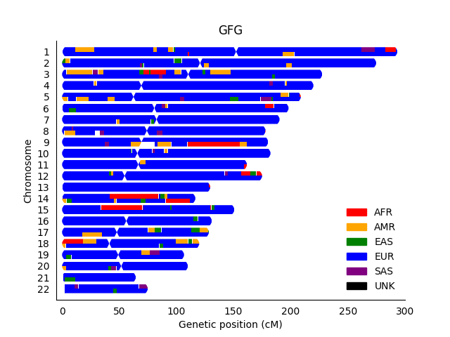
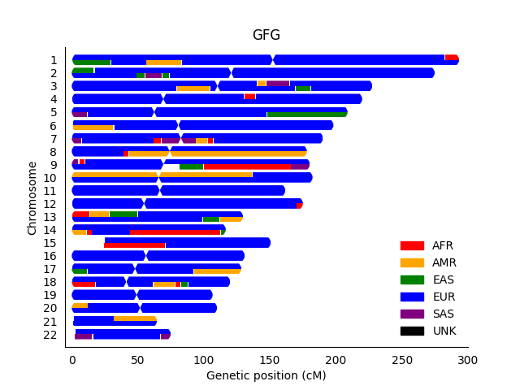
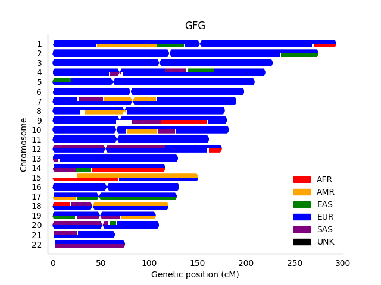
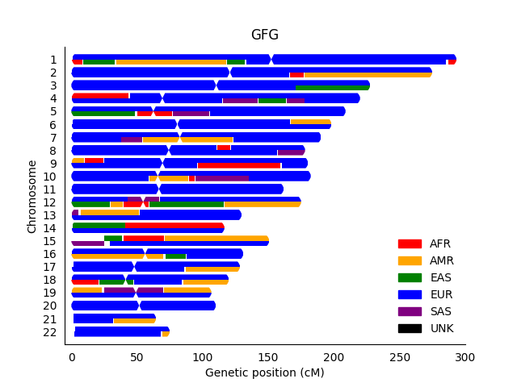
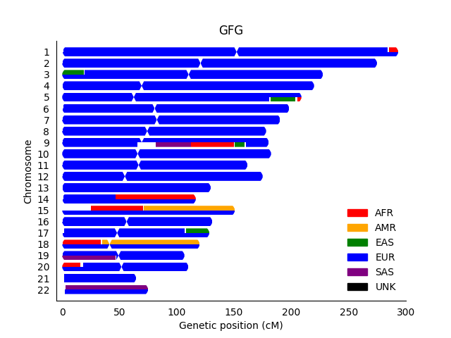
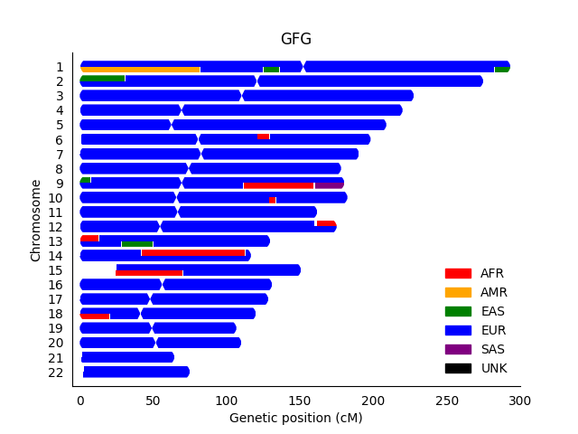

I previously tested the effect of down-sampling [my mom's X-chromosome](https://github.com/cwarden45/DTC_Scripts/tree/master/23andMe/Ancestry_plus_1000_Genomes), so I thought it would be good to do something similar with my entire genome with my Genes for Good dataset.

10x Reduction in Reference Set (**133 Reference Samples**):

10x Reduction in Reference Set, 10x Reduction in Probes (**133 Reference Samples, 28,664 Probes**):

I believe ~30,000 variants is in the ballpark used by [basepaws](https://github.com/cwarden45/Bastu_Cat_Genome/tree/master/Basepaws_Notes).

10x Reduction in Reference Set, 18x Reduction in Probes (**133 Reference Samples, 15,924 Probes**):

I choose this weird number to roughly match the number of [QC Array](https://www.illumina.com/products/by-type/microarray-kits/infinium-qc.html) probes.

As a sort of worst-case scenario, I went further:

20x Reduction in Reference Set, 18x Reduction in Probes (**66 Reference Samples, 15,924 Probes**):

While there are clearly large segments of inaccurate ancestry, all of the above plots would indicate that I am mostly European.  So, it could be a lot worse.

Now with that for perspective, I testing using the full reference set (of unrelated individuals) with reduced probes:

18x Reduction in Probes (**1,329 Reference Samples, 15,924 Probes**):

10x Reduction in Probes (**1,329 Reference Samples, 28,664 Probes**):

