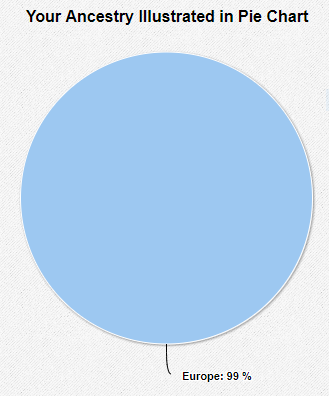
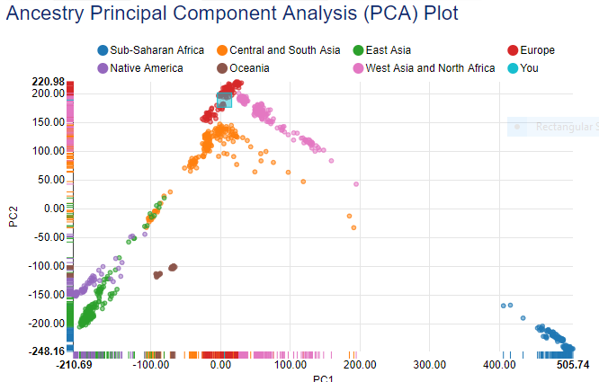
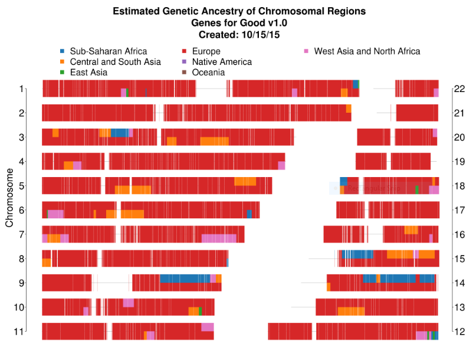
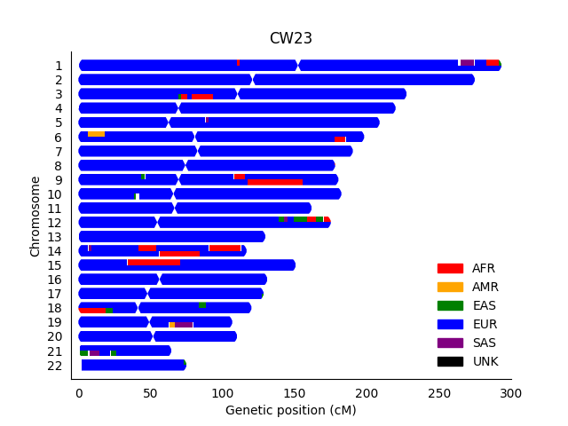
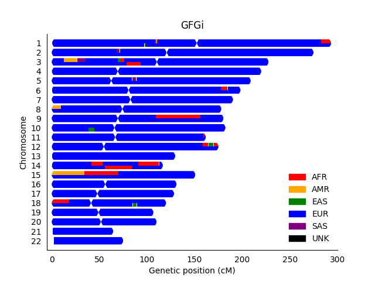

Personal Thoughts
-----------------

First for those that haven't seen the report uploaded on my [PGP page](https://my.pgp-hms.org/profile/hu832966), here are my ancestry visualizations provided by Genes for Good:







From what I saw above, my overall impression was the chromosome painting can be less robust than some other genome-wide ancestry assignments.  However, [as I mentioned in the main section](https://github.com/cwarden45/DTC_Scripts/tree/master/Genes_for_Good), they acknowledge that there can be some non-trivial false positives (or "swapped ancestry").  So, presentation of results with inappropraitely high confidence is **not** my concern.

Instead, since I was able to luckily get some pointers about the code used for chromosome painting in Genes for Good (using [RFMix](https://sites.google.com/site/rfmixlocalancestryinference/)), I thought this would be a good chance for me to gain first-hand experience with chromosome painting.

My understanding is that you need to start with a phased genotype file.  This would be different than what 23andMe provides, but Genes for Good provides **both** original and imputed+phased genotypes.  Also, I actually performed phasing for both Genes for Good and 23andMe genotypes (relative to the 1000 Genomes reference samples) using [SHAPEIT](https://mathgen.stats.ox.ac.uk/genetics_software/shapeit/shapeit.html).

While I very much like that they show there can be more than one genotype file defined for a given sample, I thought it was worth noting that the percent imputed sites was considerable:

**GFG Lines in *Unphased* VCF **: 554,951
**GFG Lines in *Imputed* VCF **: 7,704,551 (**~93% imputed**)

So, I set out to define a phased .vcf (with 1000 Genomes samples added for chromosome painting), with *only* sites where I actually had a genetype directly measured by the array (followed by using the imputed genotypes).

To review, these are the [1000 Genomes Super-Populations](http://www.internationalgenome.org/category/population/):

**AFR**: African
**AMR**: Ad-Mixed American
**EAS**: East Asian
**EUR**: European
**SAS**: South Asian

Here is an example of a chromosome painting with **Genes for Good Genotypes, *without* imputation**:


I used RFMix version 1 (instead of version 2).  One reason was that I couldn't get version 2 to work.  The other was that Genes for Good also uses version 1.

I bring this up because version 2 has a parameter to set the random seed, but version 1 does not.  So, I ran the same command on another day to test the effect of changing the random seed:


For comparison, this is what the RFMix chromosome painting looks like for my **23andMe** data again (***without* imputation):



Getting back to my original point / question, this is what the RFMix chromosome painting looks like for **Genes for Good** genotypes **with** imputation upstream of SHAPEIT phasing:



While there are a couple of regions that I think are more likely to be false positives (the relatively long stretch without probes on chr15 that is adjacent to a different ethnicity prediction,
and the ~11 million base pair segment of AMR+SAS on chr3 that was previously all EUR), this was not as bad as I was expecting.  However, that would have been enough to negatively effect trait/disease associations with specific genes.

Perhaps increasing the number of categories, including some that may have substantially fewer reference samples was a factor for the chromosome painting plot provided by Genes for Good? (which would appear to have a higher false positive rate, with a lot more "Central and South Asia" predictions)

Either way, what I think is most important is that a pie chart, PCA plot, and chromosome painting was provided to help critically assess the more specific results.  **So, I definitely applaud them for that!**

Running the Code
-----------------

```diff
- Please note that I may not be able to help with troubleshooting this code.  So, this part is for experienced users only!
```

For example, please note that you will need to go in an change the code for your own samples.  Nevertheless, if the code that I provide helps with analysis of your own samples, then that is awesome!

**1)** combine_VCF.pl

 - Recommend using *unphased* input VCF (although you can also use this to see the effect of phasing, with a noticably increased run-time)
 - Filter for 1000 Genomes unrelated individuals (see [23andMe Ancestry](https://github.com/cwarden45/DTC_Scripts/tree/master/23andMe/Ancestry_plus_1000_Genomes) for notes on targeted set of samples), at positions where you had genotypes without any imputation.
 - Create sample mapping for RFMix

**2)** separate_VCF_by_chr_and_run_SHAPEIT.pl

 - Prepare RFMix input by creating per-chromosme VCF files, converting the file format via [plink](https://www.cog-genomics.org/plink/2.0/), and then phasing each chromosome via [SHAPEIT](http://mathgen.stats.ox.ac.uk/genetics_software/shapeit/shapeit.html#download).

**3)** run_RFMix_v1.5.4.pl (in folder where RFMix is installed)

 - For certain steps, I used scripts from [Alicia Martin's Ancestry Pipeline](https://github.com/armartin/ancestry_pipeline)
 - It took me a little while to sort out the file formatting.  So, if it helps other people, I have some notes [here](https://github.com/slowkoni/rfmix/issues/15)
 - I also uploaded genetic map files to use, which are described in [this issue](https://github.com/armartin/ancestry_pipeline/issues/11)
 
In addition to the [RFMix manual](https://github.com/slowkoni/rfmix/blob/master/MANUAL.md), this [ancestry_pipeline tutorial](https://github.com/armartin/ancestry_pipeline) was also invaluable in helping me prepare the necessary files.

Also, I ran the SHAPEIT analysis (per-chromosome) on Google Cloud, making use of the [$300 credit](https://cloud.google.com/free/) offered to new users.
