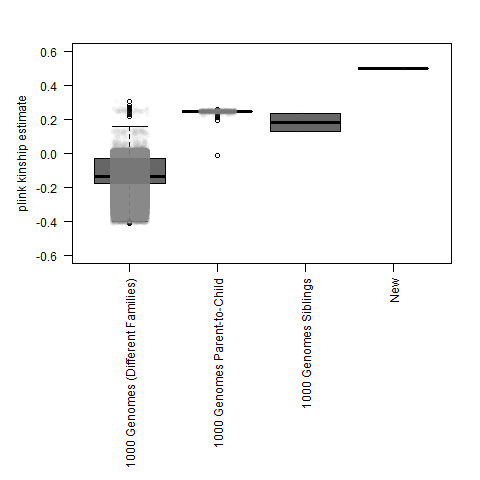
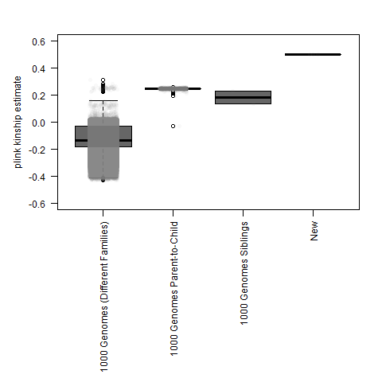

*0)* If you have high-throughput sequencing data and you don't have a gVCF, you can create one from a .bam alignment file using `create_GATK_gVCF.sh`.

If you have SNP chip genotyping data you may also need to convert that to .vcf format (Genes for Good will provide a .vcf format file, but the format is different for 23andMe and AncestryDNA).

**1**) Combine 1000 Genomes genotypes with your samples genotypes (among matched sites) using `combine_VCF.pl`.

These scripts won't be very useful if you don't have multiple samples for yourself (or other family members).  So, you'll want/need to run it multiple times, editing the code to keep adding one extra sample to the vcf.

You might want to run `wc -l` on the combined files, to check the number of variants kept at each step.

Also, the gVCF that I got for my Helix Exome+ sample (which is who produced the raw Mayo GeneGuide data) was for hg38 when everything else was for hg19.  So, I converted that gVCF back to hg19 using [CrossMaphttp://crossmap.sourceforge.net/#convert-vcf-format-files]() in the script ``.

I also needed to download the chain for hg38-to-hg19, which is available [here](http://hgdownload.cse.ucsc.edu/goldenpath/hg38/liftOver/).

**2)** Convert .vcf and .ped files to plink format, and then run IBD/kinship calculation using `plink_VCF_IBD.sh`.

As described in the [plink2 manual](https://www.cog-genomics.org/plink/2.0/distance#make_king), KING kinship coefficients should be ~0.50 for the same sample, ~0.25 for 1st degree relatives (parent-chilid, full siblings), ~0.125 for 2nd degree relatives, etc.).

**3)** Filter file and plot new sample kinship value using `plot-and-filter_king_values.R`

An example with just two SNP chips (*with 93,939 positions*):

Similar plot with 2 SNP chips and the Mayo GeneGuide Exome+ (*with 26,134 positions*):

