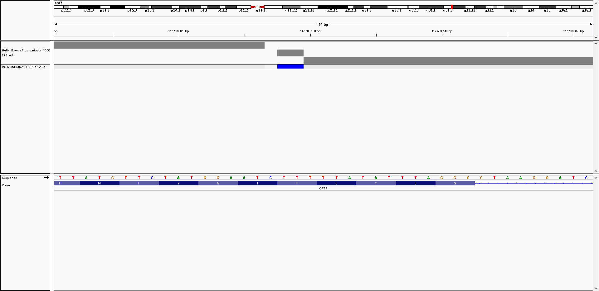

```diff
- At least currently, please note that I would recommend against purchasing this test, for the following reasons:
```

- You can download raw data (in the form of a gVCF file), but that is Exome+ data that has to be purchased and downloaded from the Helix website (for $499 + tax, which is more than twice the initial cost of $179)
- The GeneGuide report says that I was not a Cystic Fibrosis carrier.  However, I was identified as a Cystic Fibrosis carrier by 23andMe, with a variant listed in [ClinVar](https://www.ncbi.nlm.nih.gov/snp/rs121908769#clinical_significance) as being "Pathogenic" for Cystic Fibrosis.
  - I could confirm that I had that variant with my Veritas WGS and Genos Exome [alignments](https://github.com/cwarden45/DTC_Scripts/tree/master/Genos_Exome), and Helix Exome+ data used for GeneGuide (with an [IGV](http://software.broadinstitute.org/software/igv/) gVCF screenshot shown below)
  - The representitive from PWNHealth (the genetic counselor recommended by GeneGuide) also confirmed that the cystic fibrosis variant was clinically significant.
  - To be fair, I just focused on the raw Veritas WGS data from the Personal Genome Project (and my CF variant wasn't recognized by the GET-Evidence report, I believe because of a Freebayes indel formatting issue).  Likewise, I don't see this indel CFTR variant in the interface provided by Genos, even though I can verify it's presence with the Genos Exome alignment.  Those weren't as big a deal to me (since the main goal was to get the raw data for exploratory analysis); that said, in the bioinformatics research context, I do think this matches my experience that you often should not consider your "initial" results as your only possible interpretation of your data.  However, the point is that more than one company reported a false negative.
  - While I the goal of providing a specialized advice for a limited number of diseases is a *very good* idea (along with providing raw data for research purposes and/or export to analyze with free interpretation software), I think something should have been mentioned about this variant (given that GeneGuide was only testing for 4 disease genes).

- I believe a very important education component of "DNA tests" is being able to connect to the primary literature, and use your own sample to help critically assess what you read/hear about genomics research.
  - 23andMe (and, at least for what I have seen so far, Color Genomics) provides primary literature citations: *I believe there was only one literature reference in the entire Mayo GeneGuide PDF report* (while that reference only had the last name of the first author and the publication date, I believe it was for the general [Richards et al. 2015](https://www.ncbi.nlm.nih.gov/pubmed/25741868) ACMG recommendations).
  - Mayo GeneGuide does provide some additional background in the web-interface, but I think access to the primary data / literature is extremely important.
  - So, if there is greater emphasis on providing information for a smaller number of diseases, I think that information should be more detailed so that patients and physicans can have a better idea about the justification of their carrier status and/or increased disease risk.
- Under "Tools --> "Breast Cancer Risk Assessment", I filled out the information for the Breast Cancer Referral Screening Tool (B-RST).  I was predicted as being **High Risk**, but that doesn't seem right to me: namely, GeneGuide knows my gender (Male), but I didn't provide that again for this particular assessment (and I would expect even a higher risk male is at lower risk than a typical woman).
  - Also, I don't believe GeneGuide provides a genetic cancer risk assessement testing, so it seems bit strange to provide this non-genetic assessment without a genetic assessment from something whose analysis is primarily meant to come from genomic sequencing (**if so, I think focusing on doing a better job for a limited number of genetic assessments should be a priority, and this part probably should be removed**).
- You can get ancestry results under "Tools --> Health Ancestry", which predicted I was 95% European, 3% African, 1% Indigenous American, and 1% Other.  As mentioned X, I think the low percent ancestry results are accurate
  - In 23andMe, the "East Asian and Native American" ancestry [goes away](https://github.com/cwarden45/DTC_Scripts/tree/master/23andMe/Ancestry_plus_1000_Genomes) if I increase the confidence threshold.
  - I am still assessing the African component, but I have a feeling this may not be precise (and my Color Ancestry indicates that I am 100% European).
  - Also, my pie chart is not to scale (a 5% is represented as ~25%, with equal sized segments for 1% and 3%), and it wasn't really accurate to say "Health Ancestry" since no additional health-centric information was provided.
  - **So, in this situation, I think it would be better to not provide any ancestry results, than to provide these results.**
- In the "Welcome" Tutorial (under "Genetic Fundamentals"), slide #2 indicates ADHD has 70% Heritability.
  - First, GeneGuide doesn't provide any specific genetic risk assessments about ADHD.
  - Second, I am not sure how the overall heritiablity is being estimated.  In general, I would like to see more risk assessments for different cohorts for specific variant risk assessments, but my concern here is about a mental health trait that I would expect is connected to your environment at home and/or cultural beliefs that could affect behavior between generations (which I think should make the strictly genetic component harder to estimate).
  - Plus, I have never been diagnosed with ADHD, but my other mental health treatments have resulted in substantial improvments (over 10+ years).  So, how you react do your symptoms is very important, and treatment likely has a cognitive therapy component (so, if ADHD is in fact heavier on the "nature" component according to GeneGuide's Tutorial, my concern is that I think the treatment probably at least partially involves something you could arguably call "nurture").
- Finally, it is more of a personal opinion than the above points, but seeing "TM" across the various web pages (for GeneGuide, B-RST, etc.) personally gives me a negative impression, particularly with the concerns above.
  - As long as no one is trying to patent the risk assessments and/or limiting the generic ability to obtain genetic information for risk assessments (or claiming ownership of genetic information/samples), I guess this is really just a pet peeve of mine.  Also, to be fair, I don't think this unique problem just for the Mayo GeneGuide.  However, I still wanted to bring it up.
  - For example, ***on the positive side, I strongly believe [Mayo](https://www.mayoclinic.org/patient-care-and-health-information) is an excellent resource for free medical information.***  So, my negative opinions about GeneGuide are not representative of my overall opinions of Mayo.
  
With all of that being said, I very much honestly want to emphasize that learning experiences can be important, and long-term effects can be positive if lessions are learned for future improvements (both for this directly involved with a project, as well as the broader global community).

For example, I wonder if other situations could be negatively affecting something not optimal related to having raw data processing and biological interpretations done by two differents sets of people that may not have frequent communication with each other (although some of that would be almost impossible to say for certain, without working for the organization).  I am mostly thinking about having separate operations at Mayo and Helix, but it is possible that this might complement some of my own experiences (however, in terms of my own experiences, I have to admit that I need to work on understanding things and explaining myself more clearly).
-->Also, I see this concern about over-compartmentalization of steps (separating data production by Helix and interpration by staff within Mayo, for example) may not be completely consistent with the idea that you can have free,open-source interpretation agnostic of the experimental conditions; however, one of the genetic counselors that I talked to was very familiar with the 23andMe interface, so I think it might be reasonable to have data processing strategies most people think are OK for "initial" analysis in most situations (with the caveat that you always need your raw data, and an expectation that testing different analysis methods may help you understand your genome better, and specialized re-analysis may be necessary for some loci).
