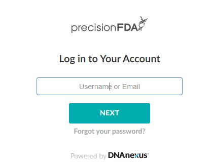
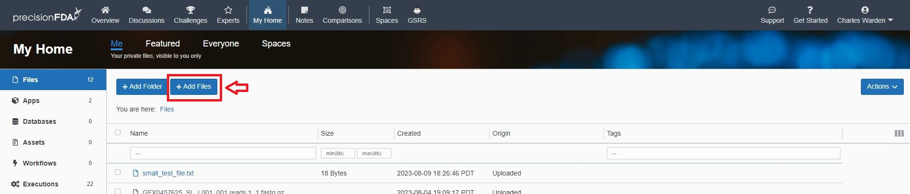
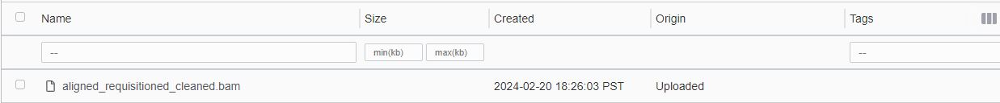
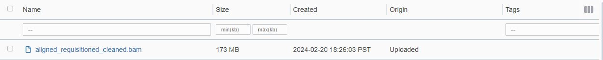
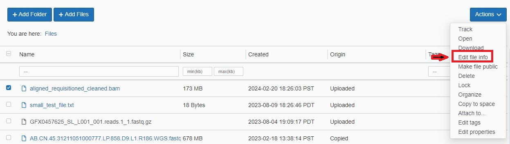
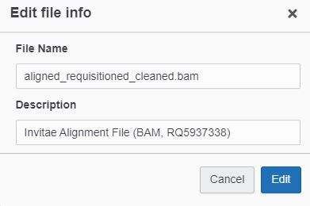
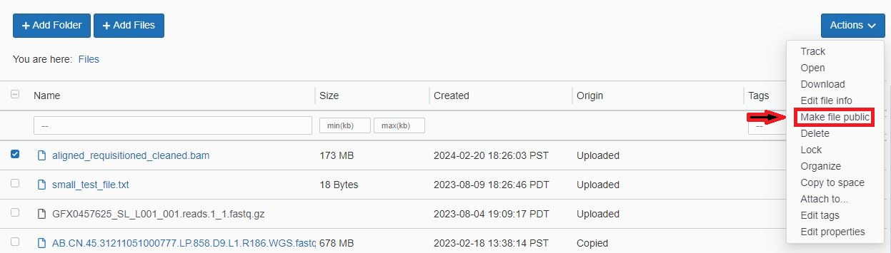
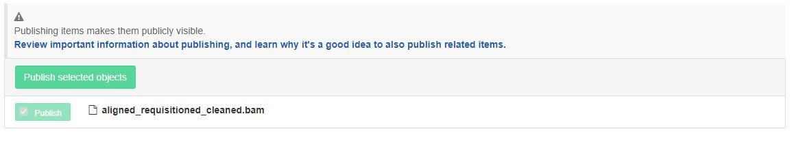
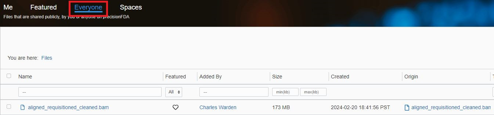
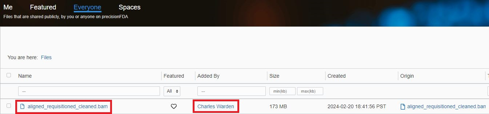

### Timeline Information

I ordered a kit on 12/4/2023.

I recieved physician approval ("physician-mediated" - I did not meet this physican) on 12/5/2023.

I believe my kit was delivered on 12/7/2023, which is indicated in my report as the sample collection date.  I put the sample in the mail as soon as possible.

Invitae indicated that they recieved my sample on 12/12/2023.

I was notified that I could view my results on 12/22/2023.  I also contacted the company about raw data on that date.

I am expecting to be able to recieve a BAM alignment file by contacting *clientservices@invitae.com*, based upon the FAQ question "*Can I download my genetic data?*".

I received a request for a DocuSign signature on 12/28/2023 (in order to recieve my raw data).

On 1/10/2024, I recieved an message from an e-mail address ending with *revspringinc.com* indicating that payment was due to Invitae.  Some content looked like it was from Invitae, so I sent an e-mail (including a screenshot from my earlier message that confirmed payment at the time of ordering) to *billing@invitae.com*, in order to check if should follow the link from that message.

The next day (1/11/2024), I recieved a paper bill form Invitae.  *The itemized charges (including some individual genes( interesting to see.*  Fore example, the charge for *"BRCA1&2 GEN FULL SEQ DUP/DEL"* and *"BRCA2 GENE FULL SEQ ALYS"*  were both *$2.39.*  However, the paper bill was for the *exact same amount* as in my confirmation e-mail (*$368*), and I confirmed that same amount was present on my credit card in December.  On 1/15/2024, a member of the billing department confirmed that the records will be updated and no additional payment is needed.

I sent a follow-up e-mail on 1/20/2024.  On 1/24/2024, I recieved a response indicating that my raw data was in progress.  My understanding is that I can hopefully receive my raw data in another week or two.

On 1/31/2024, I recieved an invite from Box to recieve my raw data, which I then uploaded to Google Cloud:

[aligned_requisitioned_cleaned.bam](https://storage.googleapis.com/cdw-metagenomics/Invitae/aligned_requisitioned_cleaned.bam)

[aligned_requisitioned_cleaned.bam.bai](https://storage.googleapis.com/cdw-metagenomics/Invitae/aligned_requisitioned_cleaned.bam.bai)

[aligned_requisitioned_cleaned.bam.md5](https://storage.googleapis.com/cdw-metagenomics/Invitae/aligned_requisitioned_cleaned.bam.md5)

[genes.txt](https://storage.googleapis.com/cdw-metagenomics/Invitae/README.txt)

[README.txt](https://storage.googleapis.com/cdw-metagenomics/Invitae/genes.txt)

I verified the integrity of the data using the `md5sum` command, to confirm that the checksum was the same was within the file *aligned_requisitioned_cleaned.bam.md5*.

On 2/8/2024, customer support informed me that the genome reference was **GRCh37** (*hg19*).

### Report Information

The [report](https://github.com/cwarden45/DTC_Scripts/blob/master/Invitae/report_RQ5937338.pdf) includes a positive result for the **F5** gene (for [ClinVar Accession 642](https://www.ncbi.nlm.nih.gov/clinvar/variation/642)).

This result is **not** consistently reported from all companies/organizations.  For example, this result is **not** provided in my [*All of Us* Hereditary Disease report](https://github.com/cwarden45/DTC_Scripts/blob/master/All_of_Us/Hereditary%20Disease%20Risk%20-%20230408.pdf) from the NIH.

However, this variant ([rs6025](https://www.ncbi.nlm.nih.gov/snp/rs6025)) is listed in [my *23andMe* results](https://github.com/cwarden45/DTC_Scripts/blob/master/23andMe/23andMe--HealthPredispositionRisk--231222.pdf) as being at ***"Slightly Increased Risk"*** for *Hereditary Thrombophilia*.

I believe this variant is also described in my [Sequencing.com](https://github.com/cwarden45/DTC_Scripts/blob/master/Sequencing.com/Healthcare_Pro-211016.pdf) report.  However, I think I may prefer the description provided by *23andMe* (and I prefer this *Invitae* summary over what is provided from *Sequencing.com*).

### Steps to Upload Data into PrecisionFDA

**1)** Go to [https://precision.fda.gov/](https://precision.fda.gov/).

If you have not already done so, please [*"Request Access"*](https://precision.fda.gov/request_access) to create an account (upper-right view from main screen).

**2)** Click **"Log In"**, with a process that starts with entering your Username or E-mail:

At the step of entering your passord, you might periodically find that your account has been locked.  If this occurs, please contact *precisionFDA@fda.hhs.gov* as described in the error message.

**3)** After you have signed in, to go **"My Home"**:

**4)** Select **"My Home"**, and then browse to the file to upload (in this situation, `aligned_requisitioned_cleaned.bam`).

In this situation, the file was small enough to be uploaded though the web interface.  There is also a command-line interface.  However, for my relatively more recent uploads, I needed to use [url-fetcher](https://precision.fda.gov/home/apps/app-F0pyzk000GBvX7qVG137gV5Z-1) to input files that I uploaded as pubilc links using a different strategy (such as Google Cloud).

**5)** After the upload is complete, you may not immediately be able to use the upload.

For example, you want to see a **blue link** and the **gray name** below is ***NOT*** ready for use:

In contrast, the version shown below ***IS*** ready for use:

For my upload, this process completed within a **few minutes**.

**6)** After the upload is able to be used, you may with to re-name the files, add additional information, and/or share the file with others.

**6a)** To add file information: *i)* select the file on the left, *ii)* select **Actions** on the right, and *iii)* select *Edit File Info*:

You can now enter information for the file.  I entered *"Invitae Alignment File (BAM, RQ5937338)"*:

**6b)** To share the file with others: *i)* select the file on the left, *ii)* select **Actions** on the right, and *iii)* select *Edit File Info*:

You will then be asked to confirm your decision:

With a single file, you only need to click the **Publish selected objects** button.

You can now find the shared file from the view for **Everyone**:

