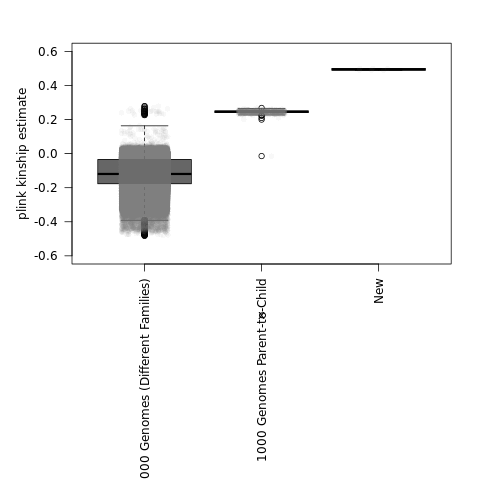
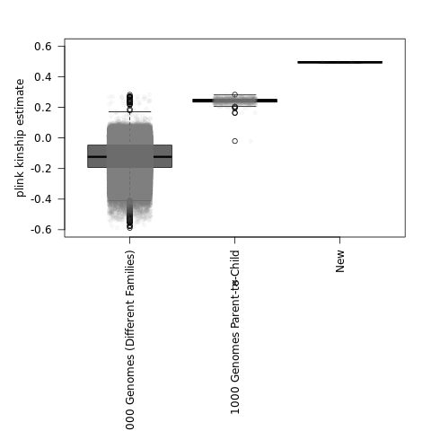
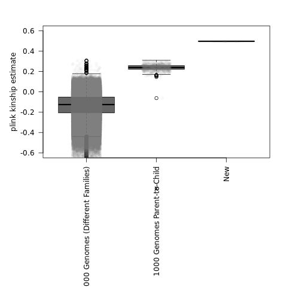
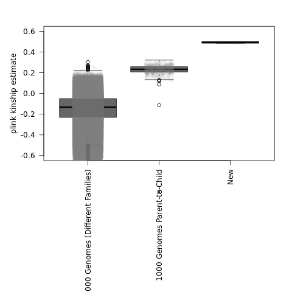
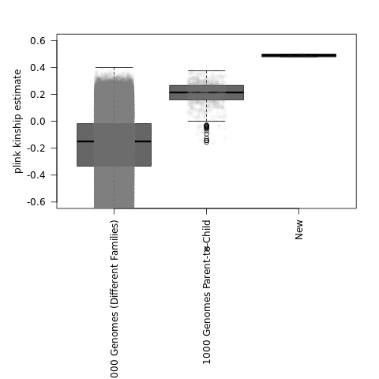
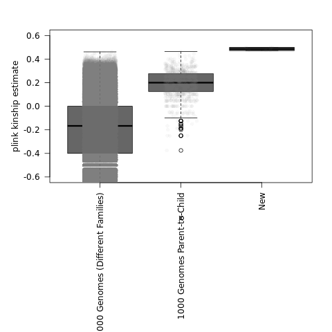
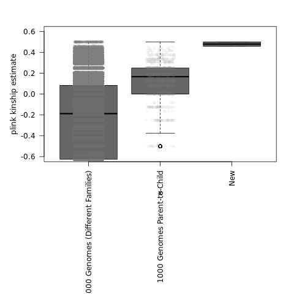

## Kinship estimates with 77,072 variants


```
FAM1	ID1	FAM2	ID2	nsnp	hethet	ibs0	kinship
0	CW23	0	GFG	77072	0.605148	0	0.499962
0	Veritas.BWA	0	GFG	76310	0.605032	0	0.499865
0	Veritas.BWA	0	CW23	76310	0.605032	0	0.499859
0	Nebula	0	GFG	77072	0.584596	7.78493e-05	0.489209
0	Nebula	0	CW23	77072	0.584596	7.78493e-05	0.489181
0	Nebula	0	Veritas.BWA	76310	0.58472	6.55222e-05	0.489226
```

## Kinship estimates with 7,707 variants


## Kinship estimates with 3,853 variants



## Kinship estimates with 1,541 variants


While not as bad as the lower variant counts, I think this is approximately where I notice greater variaibilty in the **1000 Genomes parent-to-child** relatedness estimates.

## Kinship estimates with 770 variants


```
FAM1	ID1	FAM2	ID2	nsnp	hethet	ibs0	kinship
0	CW23	0	GFG	770	0.605195	0	0.5
0	Veritas.BWA	0	GFG	763	0.605505	0	0.5
0	Veritas.BWA	0	CW23	763	0.605505	0	0.5
0	Nebula	0	GFG	770	0.584416	0	0.489514
0	Nebula	0	CW23	770	0.584416	0	0.489514
0	Nebula	0	Veritas.BWA	763	0.584535	0	0.489421
```

## Kinship estimates with 256 variants



## Kinship estimates with 154 variants



## Kinship estimates with 77 variants


## Kinship estimates with 38 variants



## Kinship estimates with 19 variants


```
FAM1	ID1	FAM2	ID2	nsnp	hethet	ibs0	kinship
0	CW23	0	GFG	19	0.526316	0	0.5
0	Veritas.BWA	0	GFG	19	0.526316	0	0.5
0	Veritas.BWA	0	CW23	19	0.526316	0	0.5
0	Nebula	0	GFG	19	0.473684	0	0.472222
0	Nebula	0	CW23	19	0.473684	0	0.472222
0	Nebula	0	Veritas.BWA	19	0.473684	0	0.472222
```

## Kinship estimates with 9 variants


```
FAM1	ID1	FAM2	ID2	nsnp	hethet	ibs0	kinship
0	CW23	0	GFG	9	0.777778	0	0.5
0	Veritas.BWA	0	GFG	9	0.777778	0	0.5
0	Veritas.BWA	0	CW23	9	0.777778	0	0.5
0	Nebula	0	GFG	9	0.666667	0	0.458333
0	Nebula	0	CW23	9	0.666667	0	0.458333
0	Nebula	0	Veritas.BWA	9	0.666667	0	0.458333
```

Even with ~0.5x lcWGS, it looks like a relatedness estimate of ~0.45 is as low as I might get.  However, notice that the 2 SNP chips and Vertias WGS estimates **remained higher with a relatedness estimate of 0.50**.

This may be useful for having an absolute threshold for lcWGS with fewer reads.  **However, the extra variability of the other relatedness estimates became more of an issue more quickly, so I am not actually saying I recommend making these estimates with 9 variants.**

For example, back at **~100 variants**, the parent-to-child and more distant relationships had overlap, and you started getting parent-to-child and/or more distant 1000 Genomes estimates that were artifically high (~0.40) with **~40 variants**.

So, if I need to prioritize quality over number of variants (and it is possible to accurately estimate that), I think the parent-to-child variation most noticably increased ~1,000 variants.  So, if you had >2,000 variants, maybe I would be more concerned about the accuracy of the variant calls than the number of variants (for self-identification)?
