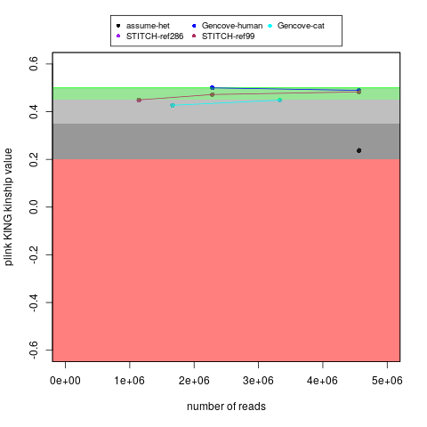

I have uploaded the imputed .vcf files for myself to my [Personal Genome Project page](https://my.pgp-hms.org/profile/hu832966).

At least currently, I have uploaded the imputed .vcf files for my cat (Bastu) on Google Cloud at the following locations:

**Down-Sample 50x**:

[Gencove_basepaws-cat_downsample_50x_impute-vcf.vcf.gz](https://storage.googleapis.com/bastu-cat-genome/Gencove_basepaws-cat_downsample_50x_impute-vcf.vcf.gz)

**Down-Sample 100x**:

[Gencove_basepaws-cat_downsample_100x_impute-vcf.vcf.gz](https://storage.googleapis.com/bastu-cat-genome/Gencove_basepaws-cat_downsample_100x_impute-vcf.vcf.gz)

There is also more information about the original data for my cat [here](https://github.com/cwarden45/Bastu_Cat_Genome).