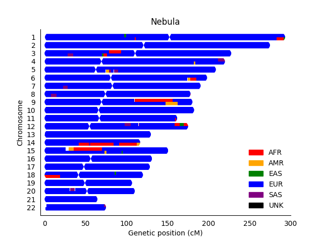
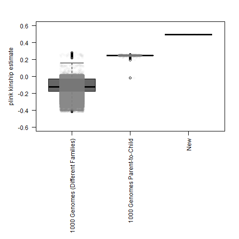
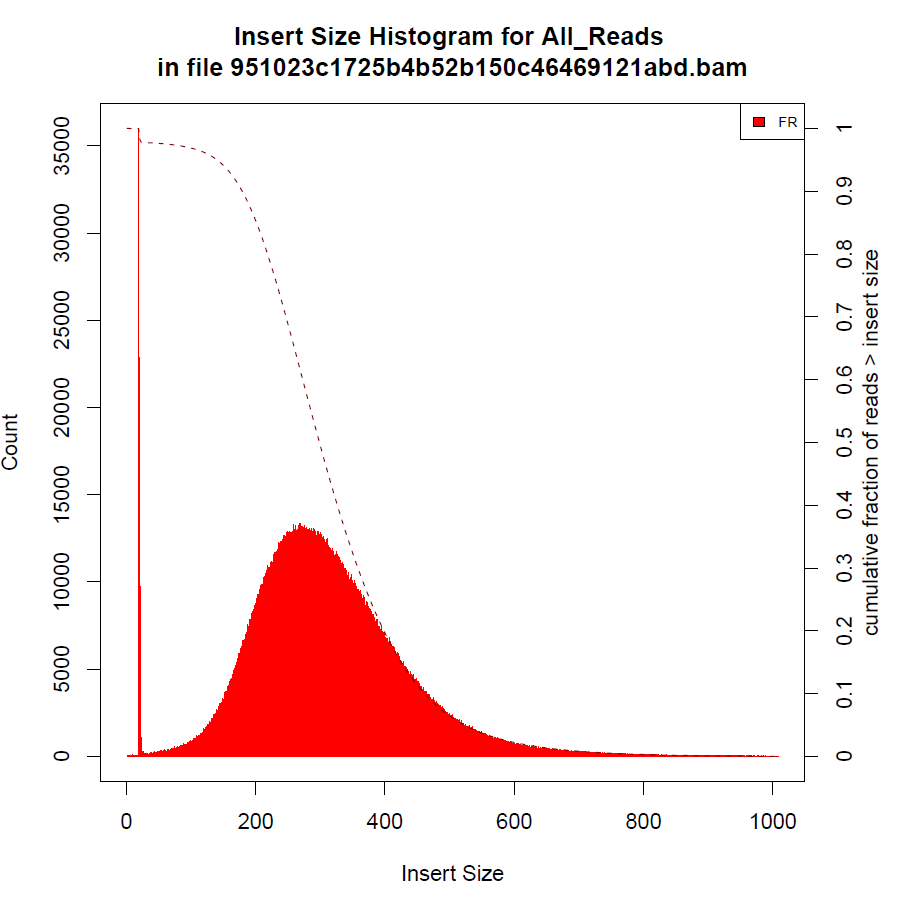

While I very much support providing FASTQ, BAM. and .VCF data, one of my concerns about the Nebula results was the use of low-coverage sequencing.

So, one of the first things that I did was visualize the alignments for some of my more confidently understood variants from previous data (using [IGV](https://software.broadinstitute.org/software/igv/))

*My cystic fibrosis variant ([rs121908769](https://www.ncbi.nlm.nih.gov/snp/rs121908769#clinical_significance))*:


*My APOE Alzhiemer's risk variant ([rs429358](https://www.ncbi.nlm.nih.gov/snp/rs429358), Nebula alignment in middle, variant is red-blue bar in the right-most exon)*:


For the two alignments above, the Genos Exome is the top alignment, **the Nebula low-coverage alignment is in the middle**, and the Veritas Whole Genome Sequencing (WGS, regular-coverage) is at the bottom.

For APOE, I zoomed out from the screenshot so that you could get a better persective of the error rate per-read at other positions around the gene.

You could see my cystic fibrosis variant in the 1 read covered at that position, but you can't see any reads with the APOE variant.  The jusitification for the low-coverage sequencing is the use of imputation (at least for traits).  However, even thought this APOE variant is somewhat common (I believe ~15% of the population), the imputation failed to identify me as having that variant.  You see that from the .vcf files

*My APOE Alzhiemer's risk variant*:

```
19      45411941        rs429358        T       C       .       PASS    .       GT:RC:AC:GP:DS  0/0:0:0:0.923102,0.0768962,1.71523e-06:0.0768996
```

The "0/0" (for genotype/GT in the last column) means that **low-coverage imputation couldn't detect my APOE variant**.  Likewise, there was no delTT variant in the VCF, so my cystic fibrosis carrier status would also be a false negative (if that was used in the report), even though you could actually see that deletion in the 1 read aligned at that position (because 1 read wasn't sufficient to have confidence in that variant).

**So, I  disagree with the use of low-coverage sequencing for traits, and I would consider removing this section (or only made available to those with higher-coverage sequencing).**

When I was trying to upload my raw data to my Personal Genome Project page, I noticed that they had an option called "**genetic data - Gencove low pass (e.g. Nebula Genomics)**".  *This makes me think discouraging low-coverage sequencing is something that needs to be done more broadly (at least for health traits).*

Even though I think they should only provide continental ancestry results (kind of like the 1000 Genomes "[super-populations](http://www.internationalgenome.org/category/population/)"), the ancestry was roughly similar to my other results (indicating that I am mostly European, which is accurate).  Plus, I don't believe the country-level assignments are actually confident enough to justify confidence in suggesting travel distinations (so, in that sense, this is a problem even when the genotypes can be called with higher confidence).

Nevertheless, if I use my imputed genotypes for RFMix chromosome painting, I get results that look roughly like my [SNP chip analysis](https://github.com/cwarden45/DTC_Scripts/blob/master/Genes_for_Good/RFMix_ReAnalysis/README.md) (which would be an improvement over the Genes for Good imputed SNPs, but compariable to the much smaller number of Genes for Good observed SNPs):



There is no plot for chrX because there are no imputed genotypes for chrX.

Similar to the IBD estimates that I calculated in [a different section](https://github.com/cwarden45/DTC_Scripts/tree/master/Helix_Mayo_GeneGuide/IBD_Genetic_Distance), I can test overall similarity between the imputed Nebula genotypes, 23andMe (**CW23**), Genes for Good (**GFG**), Veritas WGS (BWA-MEM Re-Aligned) *with 77,072 genomic positions* (plotting 1000 Genomes reference samples for comparison):



By this measure, you can also clearly see which samples come from the same individual (me).  However, there is a slight drop in the accuracy for the Nebula imputed values (with kinship values between 0.489181 and 0.489226, instead of between 0.499859 and 0.499962):

```
FAM1	ID1	FAM2	ID2	nsnp	hethet	ibs0	kinship
0	CW23	0	GFG	77072	0.605148	0	0.499962
0	Veritas.BWA	0	GFG	76310	0.605032	0	0.499865
0	Veritas.BWA	0	CW23	76310	0.605032	0	0.499859
0	Nebula	0	GFG	77072	0.584596	7.78493e-05	0.489209
0	Nebula	0	CW23	77072	0.584596	7.78493e-05	0.489181
0	Nebula	0	Veritas.BWA	76310	0.58472	6.55222e-05	0.489226
```

Because I believe most people are recieving low-coverage sequencing from [basepaws](https://github.com/cwarden45/Bastu_Cat_Genome) for $95 (while I ordered ~15x sequencing for $1000), I thought it might be good to have plots similar to sections of that repository.

For example, here are the FastQC Plots (similar to the [Read_QC](https://github.com/cwarden45/Bastu_Cat_Genome/blob/master/Basepaws_Notes/Read_QC/README.md) section):


The plots above show that the insert size is probably larger for my Nebula dataset than Bastu's basepaws dataset (since I see fewer adapters in the sequences).  This is confirmed below:



While there are considerably fewer genomic sequences smaller than the Illumina read length (relative to my basepaws sample), I can still use the scripts to parse the reads to determine that my sample had dual-barcode GTAGAGGA(i712)+TACTCCTT(i507), sequenced by machine MG01HX02 in the 5th lane of flowcell H2GF3CCX2 (although that information is on all of the reads).  There were 21,327 reads that had those barcodes in roughly the right spot (without any other valid official Illumina barcode combinations), and there were 6,051 reads with the adapter sequences immediately adjacent to the barcodes (sequenced beyond the genomic sequence in the smaller fragments).
