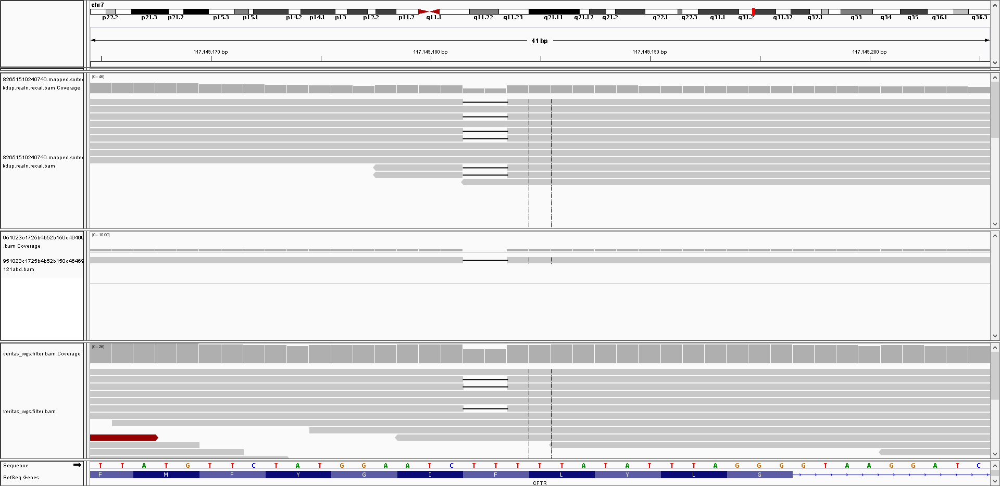
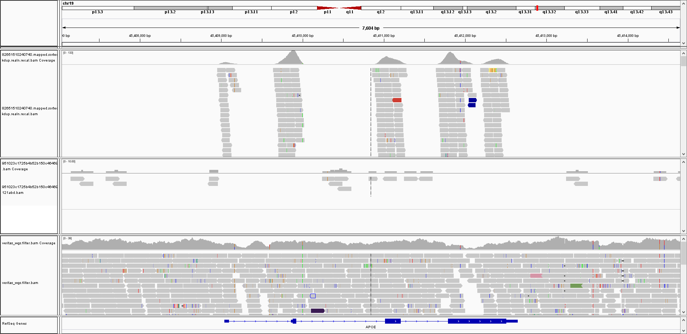
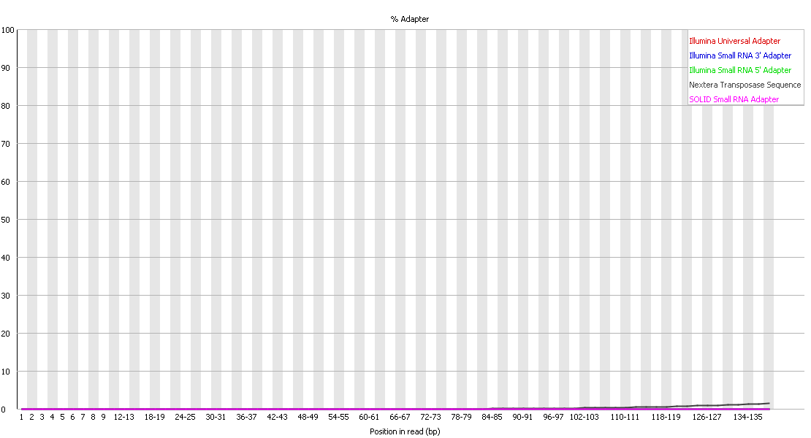
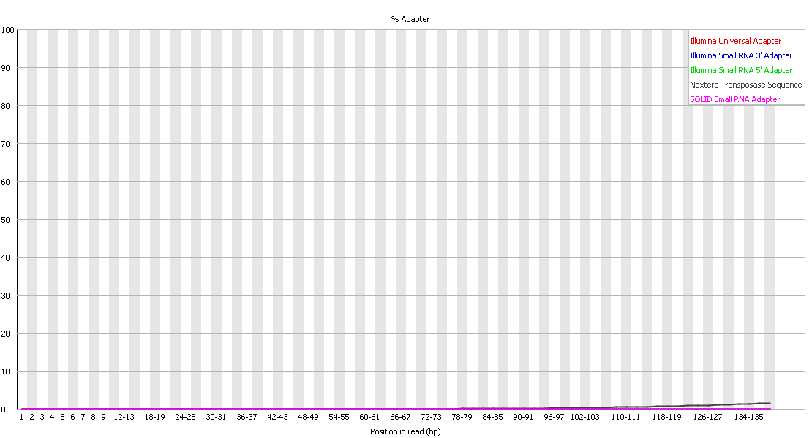

While I very much support providing FASTQ, BAM. and .VCF data, one of my concerns about the Nebula results was the use of low-coverage sequencing.

So, one of the first things that I did was visualize the alignments for some of my more confidently understood variants from previous data (using [IGV](https://software.broadinstitute.org/software/igv/))

*My cystic fibrosis variant ([rs121908769](https://www.ncbi.nlm.nih.gov/snp/rs121908769#clinical_significance))*:



*My APOE Alzhiemer's risk variant ([rs429358](https://www.ncbi.nlm.nih.gov/snp/rs429358), Nebula alignment in middle, varinat is red-blue bar in the right-most exon)*:


For the two alignments above, the Genos Exome is the top alignment, **the Nebula low-coverage alignment is in the middle**, and the Veritas Whole Genome Sequencing (WGS, regular-coverage) is at the bottom.

For APOE, I zoomed out from the screenshot so that you could get a better persective of the error rate per-read at other positions around the gene.

You could see my cystic fibrosis variant in the 1 read covered at that position, but you can't see any reads with the APOE variant.  The jusitification for the low-coverage sequencing is the use of imputation (at least for traits).  However, even thought this APOE variant is somewhat common (I believe ~15% of the population), the imputation failed to identify me as having that variant.  You see that from the .vcf files

*My APOE Alzhiemer's risk variant*:

```
19      45411941        rs429358        T       C       .       PASS    .       GT:RC:AC:GP:DS  0/0:0:0:0.923102,0.0768962,1.71523e-06:0.0768996
```

The "0/0" (for genotype/GT in the last column) means that **low-coverage imputation couldn't detect my APOE variant**.  Likewise, there was no delTT variant in the VCF, so my cystic fibrosis carrier status would also be a false negative (if that was used in the report), even though you could actually see that deletion in the 1 read aligned at that position (because 1 read wasn't sufficient to have confidence in that variant).

**So, I  disagree with the use of low-coverage sequencing for traits, and I would consider removing this section (or only made available to those with higher-coverage sequencing).**

Even though I think they should only provide continental ancestry results (kind of like the 1000 Genomes "[super-populations](http://www.internationalgenome.org/category/population/)"), the ancestry was roughly similar to my other results (indicating that I am mostly European, which is accurate).  Plus, I don't believe the country-level assignments are actually confident enough to justify confidence in suggesting travel distinations (so, in that sense, this is a problem even when the genotypes can be called with higher confidence).

Because I believe most people are recieving low-coverage sequencing from [basepaws](https://github.com/cwarden45/Bastu_Cat_Genome) for $95 (while I ordered ~15x sequencing for $1000), I thought it might be good to have plots similar to sections of that repository.

For example, here are the FastQC Plots (similar to the [Read_QC](https://github.com/cwarden45/Bastu_Cat_Genome/blob/master/Basepaws_Notes/Read_QC/README.md) section):





The plots above show that the insert size is probably larger for my Nebula dataset than Bastu's basepaws dataset (since I see fewer adapters in the sequences).
