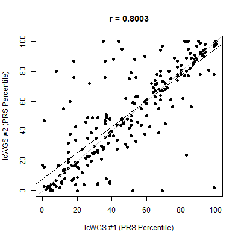
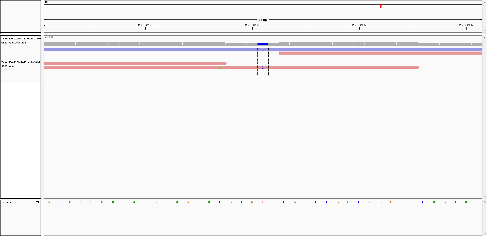

As shown above, the correlation coefficient between the PRS percentiles for the 2 replicates is 0.8 (with the largest percentile difference being 2% for one replicate and 99% for the other replicate for the “*Bone mineral density (Kemp, 2017)*” PRS).  I double-checked to confirm that this was not a typo on my end.



In my previous Nebula lcWGS sample, I received a false negative in my APOE E4 heterzgyous variant status (which was supposed to be with relatively high confidence).  This time, the correct genotype of "0/1" was provided in my .vcf file:

```
19	45411941	rs429358	T	C	.	PASS	.	GT:RC:AC:GP:DS	0/1:0:2:1.26626e-09,0.9999,0.000100479:1.0001

```

The coverage for my new sample is higher than my previous sample.  So, this should help with the imputation.  However, I currently don't know if this was intentionally increased for all runs, or there is random variation among the small libraries for each run.