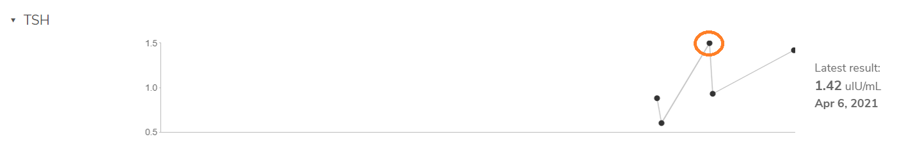

To be fair, I am starting with a [negative bias](https://twitter.com/cwarden45/status/1134864619552378880).  However, I will be very happy if I can convince people that the companies / organizations need to *i)* share your raw data with you, *ii)* share all the details for coming to their conclusions, and *iii)* have some way of publically sharing trends in their own data, with fair representations in limitations in confidence.  

In other words, that is a little different than the results being inaccurate, which is harder to show (and I have to be mindful of my prior expectations, since that can cause me to be overly harsh).

EverlyWell (Helix for DNA Sequencing):
-----------------

There were 3 "Genomics Tests" tests on the EverlyWell website.  I ordered two of them (the **Food Sensitivity Test+** and **Metabolism Test+**).

One thing that I thought was interesting was that EverlyWell provides a way to share a hyperlink for your results:

**Food Sensitivity Test+**: https://my.everlywell.com/share/bb7b19955a388aa6292a8236

**Metabolism Test+**: https://my.everlywell.com/share/d0290a346aa6994e4fb5ad4e

The individual PDF that you can download contains both the blood test and the DNA test data for the **Metabolism+ Test**, but only the blood results for the **Food Sensitivity Test+** (so, I uploaded a PDF with screenshots for DNA part, even though the above link is probably preferable).

I also uploaded the Doctor versions.  At least for the *Food Sensitivity* test, I think the patient version is better: I only had "Mild" and "Low" reactivity (no "Moderate" or "High" results).  With the possible exception of a "Mild" reactivity to cow milk, none of the reactivity was severe enough to impact my diet.  In other words, I think the doctor would probably get unnecessary alarm if they only saw an "ABNORMAL" result.

For the DNA part, I don't think this is the best way to survey your genome.  If a group has some markers that they think are intesting, some *free* interpretation of your genotypes (perhaps offered from a non-profit) seems more appropriate than charging to cover 4-5 SNPs (particularly, if they also would have used Exome+, and would have [charged extra](https://github.com/cwarden45/DTC_Scripts/tree/master/Helix_Mayo_GeneGuide) to get access to your full raw data).  However, they do provided the rsID for [dbSNP](https://www.ncbi.nlm.nih.gov/snp/), which is good.

Also, for the DNA *Food Sensitivity Test+*, most of the markers are risk associations for metabolites commonly checked in blood tests for a routine check-up (which I would imagine would be free to most people with insurance).  So, if I were a doctor, I would never prescribe the DNA part (I would just check your metabolites).  It also seems concievable to me that people may more frequently have free genome sequences with programs like [All of US](https://allofus.nih.gov/).

The blood *Metabolism test* measured 3 metabolites, so I entered them into my [Patients Like Me](https://www.patientslikeme.com/members/818028) profile.  I had been previously tested for TSH, so I could compare these measurements with an earlier test that was covered through insurance.  I'm not sure how much it matters (and it is probably about time for my next check-up), but the EverlyWell TSH level was a little higher than 2 of my previous measurements:

Because I already had Helix Exome+ data, the cost for these tests was a little lower than me.  However, the Metabolism Test then cost *$149.99* and the Food Sensitivity then cost *$209.99*.  So, if these are things that you can get through your insurance, that may be worth considering.

Also, before I got my results, I had some notes that I recorded before I forgot:

The "*Food Sensitivity*" test is a blood test (testing for **IgG reactivity**).  While I was initially confused because I had a saliva collection tube for the "*Metabolism Test*" but not the "Food Sensitivity" test (and that saliva collection tube was *not* an OrageneDx spit kit - it was just had a generic conical tube with some barcode stickers on it), **I think this is because I already have my Exome sequenced from Helix**.

Also, the saliva collection kit for the Metabolism Test is being used for something other than DNA sequencing?  To be clear, I'm not saying that the generic conical tube is bad.  However, I am saying the work needs to be done at the appropriate pace, so that I have reasonable expectations of what I will recieve.  If I see one thing on-line and I get something else delivered, that causes me some amount of concern. 

For example, what I recieved does match the [EverlyWell Food Sensitivity Test](https://www.everlywell.com/products/food-sensitivity/).  I'm still a little confused about [a product picture](https://dxkmbl8uwuv9p.cloudfront.net/myhelix/1556831649426/562cb0c0-de4d-43d8-944b-98ebbf3adf78/FS_WhatYoullGet_Img.png) on the Helix website (which actually matches what I saw, without a "Saliva Collection Tube" in the listing of kit materials).  However, I was initially sufficiently concerned that I posted a reply to the Twitter discussion thread.  Accordingly, I promptly deleted that as soon as I saw this alternative explanation.  While this still leaves me some concerns, they are not as urgent as I intially thought.  *So, I apologize if anybody saw that response in the brief time that it was posted.*

Also, as a matter of personal preference, I like getting my blood drawn by somebody else (you can't look away when you are using a lancet on yourself, and I got light-headed the one / first time that I donated a large amount of blood).  However, I realize that people with diabetes unfortunately have to do something similar every day (although I thought the volume of blood was less: I have to wait to produce enough blood for 5 large spots for each of these tests).  Nevertheless, this may be less of an issue for other people.

Also, I think the other parts of the test are being done by more specialized laboratories.  For example, I mailed my *Food Sensitivity* test to ***Alletess Medicial Laboratory***, and I mailed my *Metabolism* test to ***Ayumetrix LLC***.  I support having a centralized system to find more specialized labs / information.  However, if the analysis is really being done by different entities, I think that should be made more clear (if they deserve a non-trivial amount of credit / responsiblity).

**In contrast, I recently had my yearly-check up, and these are the maximum costs that I might be charged for my blood tests from *Quest Diagnostics* (using an Aetna PPO):**

<table>
  <tbody>
    <tr>
      <th align="center">Description</th>
      <th align="center">Price (for Insurance)</th>
      <th align="center">Maximum Out-of-Pocket Responsiblity (for Patient)</th>
    </tr>
    <tr>
      <td align="center">Lipid Panel, Standa</td>
      <td align="center">$155.22</td>
      <td align="center">$8.43</td>
    </tr>
    <tr>
      <td align="center">CBC(H/H,RBC,WBC,PLT)</td>
      <td align="center">$33.67</td>
      <td align="center">$4.85</td>
    </tr>
    <tr>
      <td align="center">Hemoglobin A1C</td>
      <td align="center">$74.25</td>
      <td align="center"><b>$0.00</b></td>
    </tr>
    <tr>
      <td align="center"><b>TSH</b></td>
      <td align="center">$130.49</td>
      <td align="center">$13.82</td>
    </tr>
    <tr>
      <td align="center">UA, Complete</td>
      <td align="center">$47.59</td>
      <td align="center"><b>$2.65</b></td>
    </tr>
    <tr>
      <td align="center">Chem Test 14</td>
      <td align="center">$88.07</td>
      <td align="center">$7.91</td>
    </tr>
</tbody>
</table>

So, again, TSH is one of the 3 metabolites covered in the **Metabolism** EverlyWell test (along with Cortisol and Free Testosterone), which cost me (the consumer $149.99; *among total of 5 large drops of blood*).  For Quest, the cost of TSH alone (**for Aetna**) was a little less than that ($130.49), but the cost to me (**the patient**) was an order of magnitude less ($13.82; *among multiple tests from 4 vials of blood + 1 cup of urine*).  Among the blood tests, the Quest TSH test had the highest Out-of-Pocket Responsibility (maximum, I could end up being charged less).  So, there is probably something important about that, but I don't currently know the explanation.

Orig3n:
-----------------

As I note in the original Twitter discussion that I referenced, I purchased two kits that used swabs (**Metabolism** and **Hunger & Weight**).

"**Hunger & Weight**" provides genotypes for 7 SNPs / genes (for $49).  Citations are provided, but genomic position / rsID not shown in web-interface.

The **Metabolism** result was not ready at the same time.  I was notified that the **Metabolism** result would be ready about 4 weeks after the lab recieves the sample.  However, I currently still do not have that result (meaning this will be the last result that I recieve on this page, even though these were the two test that I ordered first, and purchased in-store at a CVS).

Vitagene:
-----------------
Just so that I don't forget, I am noting a swab (instead of a spit-kit) was used for DNA collection (so, Orig3n isn't the only one to do this, although Vitagene used two swabs for one kit, both of which were stored in solution to be mailed).

Raw data was provide to download (comma-separate text file with genotypes).

While you can't tell from the exported PDF, they do provide the specific genotypes and a citation for associations described in the report.

While traits and ancestry would have similar benefits / concerns as other companies, I was a little more worried about the recommended supplements.  **While I do sometimes take probiotics, I would not make a decision to take that (or any other supplements) based upon what was provided to me from Vitagene.**  However, if you do have issues related to what Vitagene is proposing, I think it is probably a good idea to check with your general physican (and I especially wonder about the value in adding 6+ supplements).

That said, there is an electronic Nutritionist that you can contact for free, so I am going to confirm if I have correctly understood that part.  They explained that there is a "premium" plan that recommends 8 supplements and an "essential" plan that recommends 4-8 supplements.  They also mentioned that if you order a "premium" plan and "there are less than 8 are listed, there are likely contraindications with other medications/health conditions and the essentials plan may only be available to you"; so,you will then get less than 8 recommended supplements.  I was recommended to take 7 supplements, but they could not tell me if 1 of those 7 supplmentments might be more useful than the others.

I ordered "Premium Health + Ancestry Reports" for $119.00 (plus $9.95 shipping), so I am guessing there was a reason why I got 7 recommendations (instead of 8).

I also checked the reasons for each supplement:

*[Bromelain Quercetin Complex](https://vitagene.com/supplements/plants/bromelain) (500 mg)*: Lifestyle (Joint health and Digestive health)

In the additional information, it mentions this supplement can interact with Indomethacin (which I take for migraines, as needed).  With this information alone, I might be surprised that it wasn't flagged.  However, I've taken sleep aids with Bromelain added without any problems (although sleep / stress is not one of the reasons given to recommend this supplement).

*[Probiotics](https://vitagene.com/supplements/bacteria/probiotics) (40 billion CFU)*: **Genetics (31%, *risk of Overweight, Hormonal support, Eczema, Allergies and Blood pressure health*, based upon 103 variants, all reported to have "Fair" research quality)**, Lifesytle (Everyday stress and Digestive health), and Goals (Everyday stress and Overweight)

*[Vitamin D](https://vitagene.com/supplements/vitamins/vitamin-d) (2000 IU)*: **Genetics (59% *Vitamin D Levels, Eczema and Joint health*, based upon 36 variants, all reported to have "Fair" research quality)**, Lifesytle (Everyday stress), and Goals (Everyday stress)

*[Theanine](https://vitagene.com/supplements/amino-acids/theanine) (200 mg)*: Lifesytle (Everyday stress), and Goals (Everyday stress)

*Iron Free Multivitamin (10 Multi)*: Lifestyle (Energy and Nutrient intake levels)

*[Zinc](https://vitagene.com/supplements/minerals/zinc) (15 mg)*: **Genetics (50% *Overweight*, based upon 52 variants, all reported to have "Fair" research quality)** and Goals (Overweight)

I liked that they said zinc was *effective* for "Zinc deficiency" but *likely effective* / *likely ineffective* / *ineffective* for everything else (in that it lowers the confidence of being helpful).  However, I had to look into the additional information to see this.  In other words, if I didn't take the time to do that and automatically ordered all of these supplements, I would be taking action for something where effectiveness is not maximal (as I understand it).

That said, "weight loss" is listed as a symptom of zinc difficiency, and there is no mention of "weight" or "weight gain" for any of those categories.  So, I would probably want to do some more research before repeating that zinc can be helpful if you are overweight.  Also, I am actually within the "normal" BMI range, so the extra weight is mild (and my guess is that ab exercises are probably more important than a zinc supplement anyways).

*[Chromium](https://vitagene.com/supplements/minerals/chromium) (200 mcg)*:**Genetics (83% *Hormonal support, Overweight and Blood sugar health*, based upon 203 variants, all reported to have "Fair" research quality)** and Goals (Overweight)

Lifestyle and goals count as one category for percentages (so, genetics + lifestyle/goals adds to 100%).

I don't actually believe I have joint health issues, so I'm not sure where that is comming from.  For the probiotics, I do sometimes take those for digestive health, but I think my yearly check-up with a physican superseeds the genetic information being reported (for example, I know that I **don't** have Eczema, blood pressure problems, or abnormal vitamin D levels).  I think I have found some sleep aid supplments to be useful, so I might consider the Theanine recommendation (however, that had nothing to do with my genetics).

In other words, my impression was that the most potentially useful supplement (the probiotics) would be to help a self-reported symptom (even though there are genetic causes listed, if those are not valid, then that is not a good reason to take probiotics).  In other words, I believe this indicates the genotype information wasn't really providing information for making nutritional decisions (and, if I didn't understand the need to critically evaluate my results, might have even possibly caused me to take unneccessary supplements).  I am particularly concerned that the Vitamin D result had a >50% genetic component for the recommendation (all for symptoms that I don't have).  Given that my insulin levels are checked at my routine check-up, I am also guessing the justification for the Chromium supplement is over-emphasized.

GenoPalate:
-----------------

Uploaded 23andMe data at same time as AncestryDNA data.

"SNP not detected" doesn't explain all differences:

*Carbohydrates*:

23andMe: ZBED3 --> AA - 64.9% --> Your Recommendation: High Fiber

AncestryDNA: [ZBED3 missing]

*Carbohydrates*:

23andMe: [NOTCH2 missing]

AncestryDNA: NOTCH2 --> GG - 67.3%--> Your Recommendation: High Fiber

*Fats* (**Inconsistent**):

23andMe: ADIPOQ --> AG - 4.5% --> Your Recommendation: High Monounsaturated Fatty Acids

AncestryDNA: ADIPOQ --> AG - 46.5% --> Your Recommendation: Moderate Monounsaturated Fatty
Acids

Extra charge if you want to see customized menus.

When asked how to determine details for risk assessment (such as SNP IDs, primary literature citations / databases, etc.), I was told *[we] are not able to share with you specific studies and SNP's that we review because we keep our scientific process private*".
