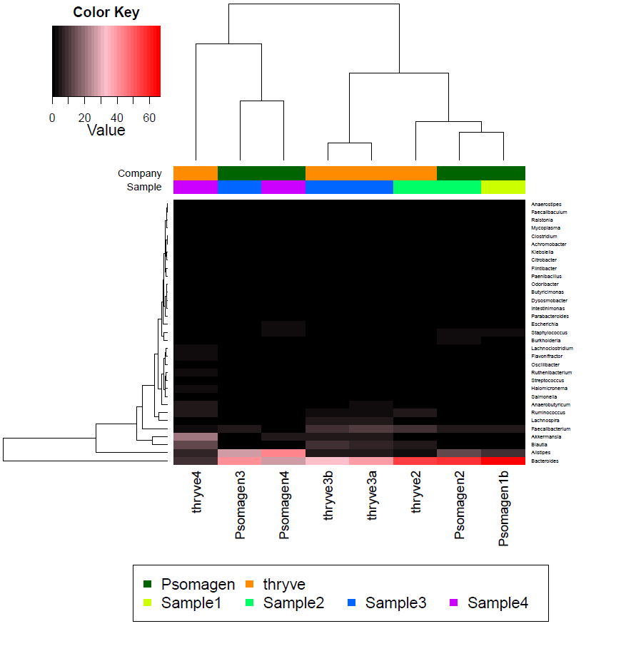

## Steps for Analysis

**1)** `run_Kracken2_Bracken-FASTQ-PE.py`

This code has been applied elsewhere, such as [here](https://github.com/cwarden45/Bastu_Cat_Genome/tree/master/basepaws_Dental_Health_Test) and [here](https://github.com/cwarden45/PRJNA513845-eDNA_reanalysis/tree/master/metagenomics).

**2)** `create_Kracken2_Bracken_table.R`

 - Use Kraken report to summarize classification rate
 - Use Bracken report to create genus-level abundance percentages
 
 <table>
  <tbody>
    <tr>
      <th align="center">Sample</th>
      <th align="center">Kraken2 Bacterial Classification Rate</th>
    </tr>
    <tr>
      <td align="center">Psomagen1b</td>
      <td align="center">61.88%</td>
     </tr>
     <tr>
      <td align="center">Psomagen2</td>
      <td align="center">57.21%</td>
     </tr>
	<tr>
      <td align="center">Psomagen3</td>
      <td align="center">58.75%</td>
     </tr>
	<tr>
      <td align="center">Psomagen4</td>
      <td align="center">55.04%</td>
     </tr>
    <tr>
      <td align="center">thryve2</td>
      <td align="center">97.66%</td>
     </tr>
    <tr>
      <td align="center">thryve3a</td>
      <td align="center">98.15%</td>
     </tr>
    <tr>
      <td align="center">thryve3b</td>
      <td align="center">97.39%</td>
     </tr>
    <tr>
      <td align="center">thryve4</td>
      <td align="center">98.99%</td>
     </tr>
</tbody>
</table>

With either strategy, the classification rate is noticably lower for the Psomagen samples than the thryve samples.  It is possible there is some other compromise, but the classification rate for Kraken2 was much higher than mothur.

