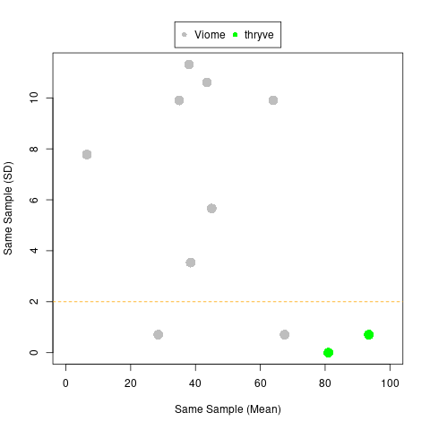

All figures and tables were created using `create_tables_and_plots.R`.

If you focus on measurements from the **same sample**, then you can see less consistency for *Viome* versus *thryve*:

 
 <table>
  <tbody>
    <tr>
      <th align="center">Signature/Score</th>
      <th align="center">Mean</th>
	  <th align="center">Standard Deviation</th>
    </tr>
    <tr>
      <td align="center">Viome Active Microbial Diversity (Percentile)</td>
      <td align="center">6.5</td>
	  <td align="center">7.8</td>
     </tr>
     <tr>
      <td align="center">Viome Digestive Efficacy</td>
      <td align="center">64.0</td>
	  <td align="center">9.9</td>
     </tr>
	<tr>
      <td align="center">Viome Gas Production</td>
      <td align="center">38.0</td>
	  <td align="center">11.3</td>
     </tr>
	<tr>
      <td align="center">Viome Gut Lining Health</td>
      <td align="center">67.5</td>
	  <td align="center">0.7</td>
     </tr>
    <tr>
      <td align="center">Viome Gut Microbiome Health</td>
      <td align="center">45</td>
	  <td align="center">5.7</td>
     </tr>
    <tr>
      <td align="center">Viome Inflammatory Activity</td>
      <td align="center">38.5</td>
	  <td align="center">3.5</td>
     </tr>
    <tr>
      <td align="center">Viome Metabolic Fitness</td>
      <td align="center">28.5</td>
	  <td align="center">0.7</td>
     </tr>
    <tr>
      <td align="center">Viome Microbiome-Induced Stress</td>
      <td align="center">43.5</td>
	  <td align="center">10.6</td>
     </tr>
    <tr>
      <td align="center">Viome Protein Fermentation</td>
      <td align="center">35</td>
	  <td align="center">9.9</td>
     </tr>
    <tr>
      <td align="center">thryve Gut Diversity Score</td>
      <td align="center">93.5</td>
	  <td align="center">0.7</td>
     </tr>
    <tr>
      <td align="center">thryve Gut Wellness Score</td>
      <td align="center">81</td>
	  <td align="center">0</td>
     </tr>
</tbody>
</table>

The 4th sample had a different phenotype than the others (harder and consistent of smaller stools compacted together, whereas the earlier samples had the more smooth and soft consistency).

While less rigorous than the collections from the same sample, I think a z-transformation (subtract mean, divide by standard deviation) might be consistent with increased variablity for Viome making true signal harder to detect:

 <table>
  <tbody>
    <tr>
      <th align="center">Signature/Score</th>
      <th align="center">Mean (Samples 1-3)</th>
	  <th align="center">SD (Samples 1-3)</th>
	  <th align="center">Sample 4 (Raw)</th>
	  <th align="center">Sample 4 (z-score)</th>
    </tr>
    <tr>
      <td align="center">Psomagen Lifestyle Status</td>
      <td align="center">70</td>
	  <td align="center">0</td>
	  <td align="center">60</td>
	  <td align="center"><b><i>Undefined</i></b></td>
     </tr>
   <tr>
      <td align="center">Psomagen Gut Health Score</td>
      <td align="center">64.3</td>
	  <td align="center">0.6</td>
	  <td align="center">45</td>
	  <td align="center"><b>-33.5</b></td>
     </tr>
     <tr>
      <td align="center">Psomagen Metabolic Concern</td>
      <td align="center">73.7</td>
	  <td align="center">3.2</td>
	  <td align="center">54</td>
	  <td align="center"><b>-6.1</b></td>
     </tr>
	<tr>
      <td align="center">thryve Gut Wellness Score</td>
      <td align="center">79.7</td>
	  <td align="center">2.3</td>
	  <td align="center">70</td>
	  <td align="center"><b>-4.2</b></td>
     </tr>
	<tr>
      <td align="center">Psomagen Metabolic Supply</td>
      <td align="center">75.3</td>
	  <td align="center">2.3</td>
	  <td align="center">66</td>
	  <td align="center"><b>-4.0</b></td>
     </tr>
    <tr>
      <td align="center">Viome Digestive Efficacy</td>
      <td align="center">57.5</td>
	  <td align="center">12.5</td>
	  <td align="center">47</td>
	  <td align="center">-0.8</td>
     </tr>
    <tr>
      <td align="center">Viome Gut Microbiome Health</td>
      <td align="center">43</td>
	  <td align="center">5.7</td>
	  <td align="center">40</td>
	  <td align="center">-0.5</td>
     </tr>
    <tr>
      <td align="center">Psomagen Nutrition Utility</td>
      <td align="center">42</td>
	  <td align="center">3.5</td>
	  <td align="center">42</td>
	  <td align="center">0</td>
     </tr>
    <tr>
      <td align="center">Viome Gas Production</td>
      <td align="center">41.8</td>
	  <td align="center">15.6</td>
	  <td align="center">45</td>
	  <td align="center">0.2</td>
     </tr>
    <tr>
      <td align="center">thryve Gut Diversity Score</td>
      <td align="center">91</td>
	  <td align="center">4.4</td>
      <td align="center">92</td>
	  <td align="center">0.2</td>
     </tr>
    <tr>
      <td align="center">Viome Inflammatory Activity</td>
      <td align="center">39</td>
	  <td align="center">4.2</td>
      <td align="center">41</td>
	  <td align="center">0.5</td>
     </tr>
    <tr>
      <td align="center">Psomagen Microbial Diversity</td>
      <td align="center">56.7</td>
	  <td align="center">5.7</td>
      <td align="center">60</td>
	  <td align="center">0.6</td>
     </tr>
    <tr>
      <td align="center">Viome Gut Lining Health</td>
      <td align="center">68.5</td>
	  <td align="center">2.4</td>
      <td align="center">70</td>
	  <td align="center">0.6</td>
     </tr>
    <tr>
      <td align="center">Viome Metabolic Fitness</td>
      <td align="center">28.8</td>
	  <td align="center">1.7</td>
      <td align="center">30</td>
	  <td align="center">0.7</td>
     </tr>
    <tr>
      <td align="center">Viome Protein Fermentation</td>
      <td align="center">49</td>
	  <td align="center">19.7</td>
      <td align="center">71</td>
	  <td align="center">1.1</td>
     </tr>
    <tr>
      <td align="center">Viome Active Microbial Diversity (Percentile)</td>
      <td align="center">7.3</td>
	  <td align="center">5.6</td>
      <td align="center">15</td>
	  <td align="center">1.4</td>
     </tr>
</tbody>
</table>

**Bold font** was applied if the absolute value of the z-score was greater than 2 (or Undefined).
