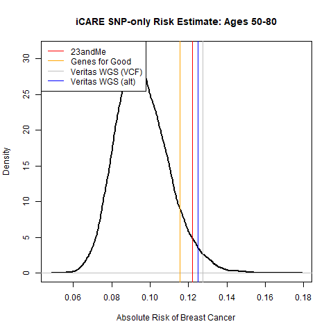

I used the vignette from the [Bioconductor package](https://www.bioconductor.org/packages/release/bioc/html/iCARE.html) to provide a Polygenic "SNP-Only" Risk Score.

This code is associated with publications [Choudhury et al. 2020](https://journals.plos.org/plosone/article?id=10.1371/journal.pone.0228198) and [Kim et al. 2020](https://aacrjournals.org/cancerpreventionresearch/article/14/2/175/47393/Impact-of-Personalized-Genetic-Breast-Cancer-Risk).

## Initial code

I used 3 sets of datasets for myself:

**1)** *23andMe* Genotypes
**2)** *Genes for Good* Genotypes
**3)** Provided *Veritas* Whole Genome Sequencing (WGS) VCF

I used annotation from to assist with this inital set of mapping.  **I was not certain about the variant nucleotide for some positions**, so I am following up with a comment on the associated publication.

Nevertheless, if I use what I could map, then I can define the following risk estimates for myself:

There are 2 Veritas WGS results, since there was not a "PASS" status for *reference* variants in the VCF.  So, if I had a mapping, then *I assumed that I had 0 variant copies at that position* (which may or may not have been true 100% of the time).

## Results following comment discussion

Of course, I am a **male**.  So, I expect my true risk for *breast cancer* to be **lower** than any of the estimates from the Polygenic Risk Score.
